<style>
body, p, li, td, th, blockquote, span, div {
    font-size: 1.1em !important;
    line-height: 1.7 !important;
}
h1 { font-size: 1.9em !important; color: #1565c0; }
h2 { font-size: 1.5em !important; color: #1565c0; }
h3 { font-size: 1.3em !important; }
h4 { font-size: 1.15em !important; }
table { font-size: 1em !important; }
strong { color: #1565c0; }
blockquote { border-left: 4px solid #1565c0; background: #e3f2fd; padding: 10px 15px; }
</style>

# Phase 00 — आधार तैयारी (Prerequisites)

**Project:** E-Learning Platform (PostgreSQL + Supabase)
**Phase:** 00 — Prerequisites (नींव)
**Files:** 11 (00 से 10 तक)

---

## Phase 00 का मकसद क्या है?

Phase 00 वो नींव है जिस पर पूरा database project खड़ा होगा। इसमें कोई भी business table (जैसे countries, courses, students) नहीं बनती — सिर्फ़ वो **tools, functions, और automation** बनते हैं जो बाद में हर table के लिए काम आएँगे।

सोचो ऐसे — **घर बनाने से पहले नक्शा, सीमेंट, और औज़ार तैयार करते हैं**। Phase 00 वही काम करता है database के लिए।

> **System Policy: Soft Delete Only**
> इस पूरे system में hard DELETE नहीं होता। Record हटाने के लिए `is_deleted = TRUE` किया जाता है (UPDATE)। इससे data कभी permanently नहीं मिटता — audit trail हमेशा बनी रहती है और recovery कभी भी possible है।

```mermaid
%%{init: {'theme': 'base', 'themeVariables': {'fontSize': '20px', 'fontFamily': 'arial'}}}%%
flowchart LR
    F00["00 - सफ़ाई"] --> F01["01 - Timezone"]
    F01 --> F02["02 - Extensions"]
    F02 --> F03["03 - Summary Table"]
    F03 --> F04["04 - Seed Function"]
    F04 --> F05["05 - Trigger Functions"]
    F05 --> F06["06 - Register Helper"]
    F06 --> F07["07 - Auto Register"]
    F07 --> F08["08 - Sync Repair"]
    F08 --> F09["09 - Dashboard View"]
    F09 --> F10["10 - Cron Job"]

    style F00 fill:#ffcdd2,color:#000
    style F01 fill:#fff3e0,color:#000
    style F02 fill:#e3f2fd,color:#000
    style F03 fill:#c8e6c9,color:#000
    style F04 fill:#fff9c4,color:#000
    style F05 fill:#ffe0b2,color:#000
    style F06 fill:#e1bee7,color:#000
    style F07 fill:#b2ebf2,color:#000
    style F08 fill:#ffccbc,color:#000
    style F09 fill:#dcedc8,color:#000
    style F10 fill:#f3e5f5,color:#000
```

---

## Files का Execution Order

ये files **हमेशा इसी sequence** में चलानी हैं। Order गलत होगा तो error आएगा क्योंकि हर file अपने से पहले वाली file पर depend करती है।

| क्रम | File | क्या करता है |
|------|------|-------------|
| 00 | 00_drop_all.sql | पूरा database साफ़ करता है — सब कुछ delete |
| 01 | 01_set_timezone.sql | Database timezone Asia/Kolkata (IST) set करता है |
| 02 | 02_extensions.sql | PostgreSQL की special powers ON करता है (7 extensions) |
| 03 | 03_summary_table.sql | table_summary table और indexes बनाता है |
| 04 | 04_seed_summary_function.sql | seed_summary_row function बनाता है |
| 05 | 05_trigger_function.sql | **6 core functions** बनाता है — system का दिल |
| 06 | 06_register_helper.sql | register_summary_trigger function बनाता है |
| 07 | 07_auto_register_event_trigger.sql | पूरा automation setup — जादू की छड़ी |
| 08 | 08_sync_repair.sql | Sync और repair functions बनाता है |
| 09 | 09_dashboard_view.sql | Admin dashboard view बनाता है |
| 10 | 10_cron_sync_job.sql | हर Monday 01:00 AM पर auto sync schedule करता है |

---

## File 00 — 00_drop_all.sql (सफ़ाई Script)

### मकसद

ये file पूरे database की सफ़ाई करती है। जैसे घर तोड़ने के बाद ज़मीन साफ़ करते हैं — बिल्कुल वैसे ही ये सब कुछ delete करती है ताकि **fresh start** हो सके। Development और testing में बार-बार use होती है।

> **Supabase Safety:** इस script में Supabase के सभी internal objects protect किए गए हैं:
> - **Schemas:** auth, storage, realtime, supabase_functions, supabase_migrations, graphql, graphql_public, pgsodium, pgsodium_masks, vault, net, cron, extensions
> - **Extensions:** pgjwt, pgsodium, supabase_vault, pg_graphql, pg_net, uuid-ossp
> - **Functions:** graphql, pgrst_watch, pgrst_drop_watch, और अन्य Supabase-managed functions
> - **Triggers:** supabase_ prefix वाले और realtime triggers
>
> सिर्फ़ user-defined objects delete होते हैं — Supabase infrastructure safe रहता है।

### क्या-क्या Delete होता है?

ये **9 चीज़ें** इस order में delete होती हैं — order बहुत important है क्योंकि objects एक दूसरे पर depend करते हैं:

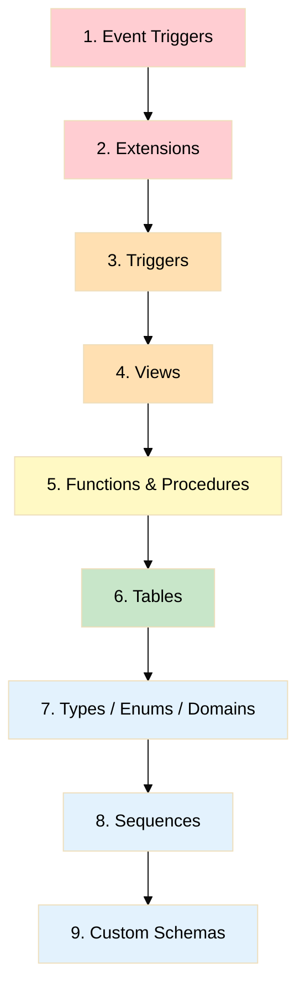

**Event Triggers** सबसे पहले हटते हैं क्योंकि ये DDL commands को रोक सकते हैं — अगर ये active रहें तो बाकी कुछ delete नहीं होगा।

**Extensions** दूसरे नंबर पर हटती हैं क्योंकि इनके पास अपनी hidden views और functions होती हैं। जैसे **pg_stat_statements** extension के पास अपनी view है — अगर पहले view delete करो तो PostgreSQL error देता है। पहले extension हटाओ, CASCADE से उसकी सारी चीज़ें अपने आप हट जाती हैं।

बाक़ी objects dependency order में हटते हैं — triggers पहले (क्योंकि tables पर लगे हैं), फिर views, functions, tables, types, sequences, और आख़िर में schemas।

### कब Use करें?

- Development में database बिल्कुल scratch से बनाना हो
- Testing के लिए clean environment चाहिए
- Production migration से पहले staging reset करना हो

> **चेतावनी:** यह बहुत destructive है — सारा user data खो जाएगा। सिर्फ़ तभी run करो जब जानबूझकर fresh rebuild करना हो।

---

## File 01 — 01_set_timezone.sql (Timezone Setup)

### मकसद

Database का default timezone **Asia/Kolkata (IST — UTC+5:30)** permanently set करता है। ये सबसे पहले चलना चाहिए ताकि बाद में बनने वाली सारी tables में TIMESTAMPTZ values, NOW(), CURRENT_TIMESTAMP — सब **Indian Standard Time** में हों।

### क्या करता है?

**दो काम करता है:**

1. **Database level** पर timezone permanently set करता है — हर नए connection के लिए IST default रहेगा
2. **Current session** में भी तुरंत apply करता है ताकि बाक़ी files सही timezone में चलें

### कहाँ असर पड़ता है?

- हर table के **created_at** और **updated_at** columns में IST timestamp आता है
- **pg_cron** scheduled jobs IST के हिसाब से चलते हैं (Monday 01:00 AM IST)
- **NOW()** और **CURRENT_TIMESTAMP** हमेशा IST return करते हैं
- Admin dashboard पर सही **Indian time** दिखता है

---

## File 02 — 02_extensions.sql (Extensions — Special Powers)

### मकसद

PostgreSQL अपने आप में बहुत powerful है, लेकिन कुछ special powers के लिए **extensions** चाहिए। जैसे phone में apps install करते हैं — वैसे ही database में extensions install होते हैं।

### 7 Extensions और उनका काम

```mermaid
%%{init: {'theme': 'base', 'themeVariables': {'fontSize': '16px', 'fontFamily': 'arial'}}}%%
flowchart TD
    E1["citext"]
    E2["pg_trgm"]
    E3["pg_trgm"]
    E4["pgcrypto"]
    E5["pg_stat_statements"]
    E6["unaccent"]
    E7["pg_cron"]

    E1 --- N1["girish = GIRISH — Case-Insensitive Text"]
    E2 --- N2["Postgre → PostgreSQL — Fuzzy Search"]
    E3 --- N3["हिंदी + English + 日本語 — Full-Text Search"]
    E4 --- N4["Password Hashing + UUID — Security"]
    E5 --- N5["Slow Query Detection — Performance Monitor"]
    E6 --- N6["café → cafe — Accent Removal for Slugs"]
    E7 --- N7["Monday 01:00 AM Auto Sync — Job Scheduler"]

    style E1 fill:#e3f2fd,color:#000
    style E2 fill:#e3f2fd,color:#000
    style E3 fill:#e3f2fd,color:#000
    style E4 fill:#fff3e0,color:#000
    style E5 fill:#fce4ec,color:#000
    style E6 fill:#c8e6c9,color:#000
    style E7 fill:#f3e5f5,color:#000
    style N1 fill:#fff,color:#000
    style N2 fill:#fff,color:#000
    style N3 fill:#fff,color:#000
    style N4 fill:#fff,color:#000
    style N5 fill:#fff,color:#000
    style N6 fill:#fff,color:#000
    style N7 fill:#fff,color:#000
```

**citext** — Case-Insensitive Text। "Girish", "girish", और "GIRISH" तीनों एक ही माने जाएँगे। Email addresses, usernames, codes, slugs — सब जगह use होता है। बिना citext के हर जगह LOWER() function लगाना पड़ता — citext से automatic होता है।

**pg_trgm** — Trigram Matching। ये text को 3-3 characters के टुकड़ों में तोड़ता है और **fuzzy search** allow करता है। अगर कोई "Postgre" type करे तो "PostgreSQL" भी मिल जाए। Course titles, user names, descriptions — सब में `ILIKE` search को power देता है।

**pg_trgm** — Full-Text Search Engine। Groonga नाम के search engine पर based है। **बहुत तेज़ multilingual** full-text search देता है। हिंदी, Tamil, Japanese — किसी भी भाषा में search कर सकते हो। Course content, forum posts, और translation tables में search के लिए use होता है।

**pgcrypto** — Cryptographic Functions। **Security के लिए** है। Password hashing (crypt और gen_salt), random UUID generation (gen_random_uuid), और secure token generation — सब इससे होता है। User passwords safely store करने के लिए ज़रूरी।

**pg_stat_statements** — Query Statistics। Database की **हर query का record** रखता है — कितनी बार चली, कितना time लगा, कितनी memory use हुई। Slow queries ढूँढकर fix करने में मदद करता है। DBA का best friend।

**unaccent** — Accent Removal। "café" को "cafe" में, "résumé" को "resume" में convert करता है। **URL slugs** बनाने के लिए ज़रूरी — clean SEO-friendly URLs बिना special characters के। `generate_slug()` function internally इसे use करता है।

**pg_cron** — Job Scheduler। Database के अंदर ही **scheduled jobs** चलाता है — बिल्कुल Linux cron की तरह। हर Monday 01:00 AM IST पर `sync_all_table_summaries` automatically चलता है। Supabase पर pre-installed है।

### Localhost पर ध्यान दें

**pg_trgm**, **pg_cron**, और **pg_stat_statements** सिर्फ़ Supabase पर available हैं। Local machine पर ये **exception blocks** में wrap हैं — crash नहीं करते, बस silently skip हो जाते हैं। बाक़ी 4 extensions (citext, pg_trgm, pgcrypto, unaccent) हर जगह काम करती हैं।

### कहाँ use होता है?

| Extension | कहाँ use होता है |
|-----------|-----------------|
| citext | हर table में names, codes, emails, slugs columns के लिए |
| pg_trgm | हर function की `ILIKE` search में (GIN indexes) |
| pg_trgm | Translation tables की multilingual search में (pg_trgm indexes) |
| pgcrypto | Users table में password hashing |
| pg_stat_statements | DBA के performance monitoring dashboard में |
| unaccent | generate_slug() function में — categories, courses के slug generation में |
| pg_cron | File 10 — weekly table_summary sync job में |

---

## File 03 — 03_summary_table.sql (Row Counting Cache)

### मकसद

सोचो आपके पास **10 लाख students** हैं। अगर हर बार dashboard पर "कितने active students हैं?" जानना हो तो पूरी table scan करनी पड़ेगी — ये **बहुत slow** है। **table_summary** एक cache है जो हर table के counts पहले से ready रखता है — instant result, कोई scanning नहीं।

### Table: table_summary

ये एक **central register** है जहाँ हर table का count stored रहता है।

| Column | Type | क्या करता है |
|--------|------|-------------|
| id | INT (Auto Identity) | हर row का unique number, अपने आप बढ़ता है |
| table_name | CITEXT (Unique) | किस table का count है — case-insensitive, duplicate नहीं हो सकता |
| is_active | INT | कितने records **active** हैं (is_active=TRUE, is_deleted=FALSE) |
| is_deactive | INT | कितने records **inactive** हैं (is_active=FALSE, is_deleted=FALSE) |
| is_deleted | INT | कितने records **soft-deleted** हैं (is_deleted=TRUE) |
| total | INT (Auto-Calculated) | is_active + is_deactive + is_deleted — **automatically** calculate, manually set नहीं कर सकते |
| updated_at | TIMESTAMPTZ | counts **कब** आख़िरी बार update हुईं |

**Constraint: uq_table_summary_name** — एक table का नाम दो बार नहीं आ सकता।

### Real-World Example

| table_name | is_active | is_deactive | is_deleted | total |
|------------|-----------|-------------|------------|-------|
| countries | 10 | 0 | 0 | 10 |
| users | 50,000 | 2,000 | 500 | 52,500 |
| courses | 1,200 | 50 | 30 | 1,280 |
| categories | 15 | 2 | 1 | 18 |

### Indexes (तेज़ Search के लिए)

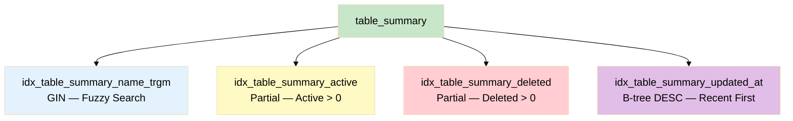

**idx_table_summary_name_trgm** — GIN index जो pg_trgm use करता है। **Fuzzy search** allow करता है — "countr" type करो तो "countries" मिल जाए।

**idx_table_summary_active** — **Partial index**, सिर्फ़ उन rows पर जहाँ is_active > 0। Active records वाली tables जल्दी मिलती हैं।

**idx_table_summary_deleted** — **Partial index**, सिर्फ़ उन rows पर जहाँ is_deleted > 0। Audit के लिए — deleted records ढूँढना आसान।

**idx_table_summary_updated_at** — B-tree index, **descending order**। Recently update हुई tables पहले दिखती हैं।

---

## File 04 — 04_seed_summary_function.sql (Entry Helper)

### मकसद

जब कोई नई table register होती है तो उसकी एक ख़ाली row table_summary में होनी चाहिए (सब counts 0)। **seed_summary_row** function ये काम करता है।

### Function: seed_summary_row

**Input:** Table का नाम (जैसे 'countries')
**Output:** कुछ नहीं (VOID)

**क्या करता है:** table_summary में एक row INSERT करता है। अगर row **पहले से है** तो ON CONFLICT DO NOTHING — कोई error नहीं।

ये function **Idempotent** है — कितनी भी बार call करो, result same। पहली बार row बनती है, बाक़ी बार skip।

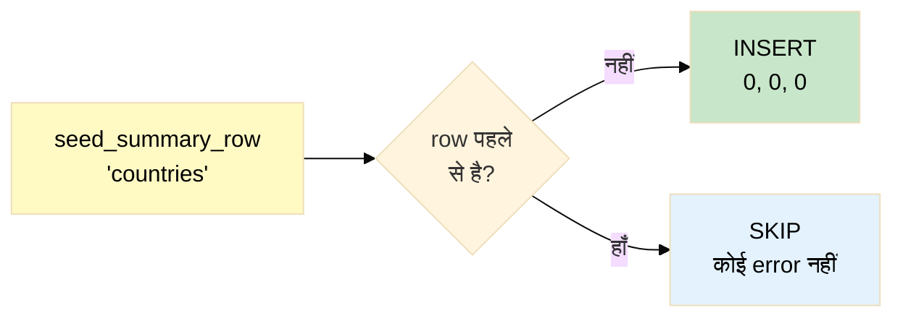

### कौन Call करता है?

सीधा user नहीं बुलाता — ये internally call होता है:

- **fn_manage_table_summary** (File 05) — पहली INSERT पर
- **register_summary_trigger** (File 06) — trigger attach करते समय

---

## File 05 — 05_trigger_function.sql (6 Core Functions — System का दिल)

### मकसद

ये **पूरे system की सबसे important file** है। **6 reusable functions** बनती हैं जो automatic events handle करती हैं। ये functions trigger से fire होती हैं — सीधा call नहीं करते।

---

### Function 1: `update_updated_at_column()` — Auto Timestamp

**मकसद:** हर UPDATE पर **updated_at = NOW()** automatically set हो। Developer को कभी manually timestamp नहीं लिखना पड़ता।

**Type:** Trigger Function — BEFORE UPDATE
**कहाँ attach है:** **हर एक table** पर `trg_{tablename}_updated_at` trigger से

**क्यों ज़रूरी है?**
- **Audit trail** — record कब modify हुआ exactly पता
- **Manual mistake impossible** — भूलने का chance ही नहीं
- **Consistent** — हर table, हर record पर same behavior

---

### Function 2: `fn_manage_table_summary()` — Count Management (सबसे Important)

**मकसद:** हर INSERT और UPDATE पर **table_summary** counts automatically update हों। Soft delete भी UPDATE है, इसलिए cover होता है।

**Type:** Trigger Function — AFTER INSERT OR UPDATE
**कहाँ attach है:** हर table पर `trg_summary_{tablename}` trigger से (automatic via File 07)

#### INSERT पर

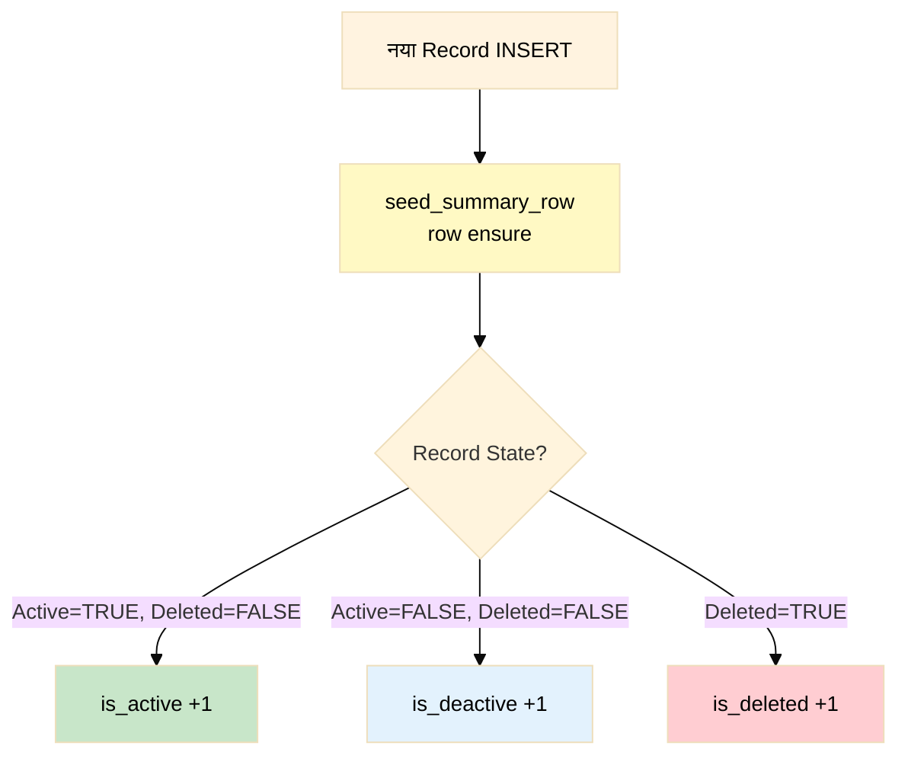

#### UPDATE पर (Soft Delete भी)

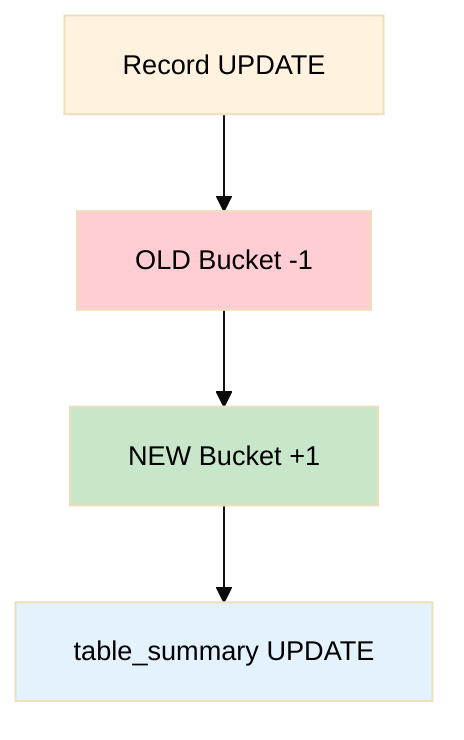

#### Delta Examples

**Japan को deactive → active किया:**

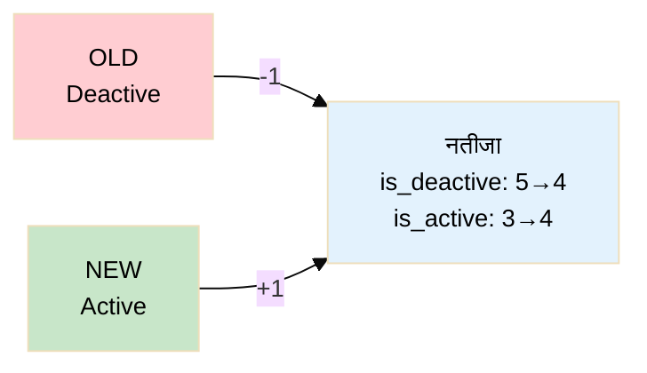

**Japan को soft delete किया (is_deleted = TRUE):**

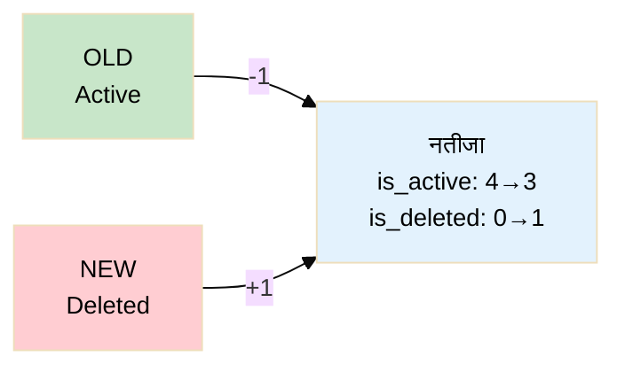

**Safety:** `GREATEST(0, ...)` use होता है — count **कभी negative** नहीं होगा।

---

### Function 3: `generate_slug()` — URL-Friendly Text

**मकसद:** किसी भी text को **clean, URL-friendly slug** में convert करना।

**Type:** Pure Utility (IMMUTABLE — same input, same output, indexes में safe)

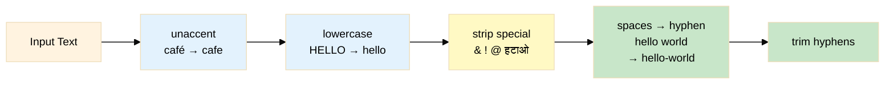

| Input | Output |
|-------|--------|
| "Advanced AI & ML with Python" | advanced-ai-ml-with-python |
| "Café résumé" | cafe-resume |
| "  Hello   World  " | hello-world |

**कहाँ use होता है:** fn_auto_slug और fn_backfill_slug internally call करते हैं। Categories, sub-categories, courses के URL slugs।

---

### Function 4: `fn_auto_slug()` — Auto Slug Generation

**मकसद:** Record CREATE/UPDATE पर **slug automatically generate** हो।

**Type:** Trigger Function — BEFORE INSERT OR UPDATE
**कहाँ attach:** categories, sub_categories, courses

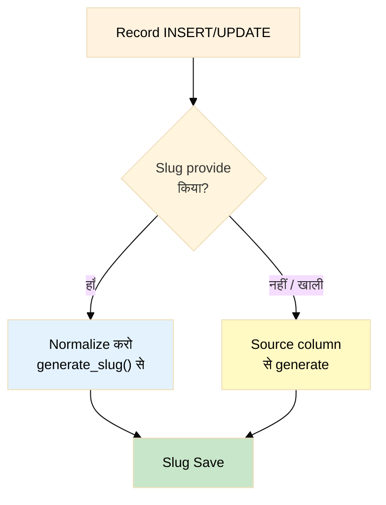

**Parameter:** `TG_ARGV[0]` — source column (जैसे 'code')। code = 'CAT-DEV' है, slug empty → slug = 'cat-dev' automatic।

---

### Function 5: `fn_backfill_slug()` — Translation से Parent Slug भरना

**मकसद:** Translation INSERT हो और parent slug **NULL** हो → translation name से slug generate करके parent में भर दो।

**Type:** Trigger Function — AFTER INSERT
**कहाँ attach:** category_translations, sub_category_translations

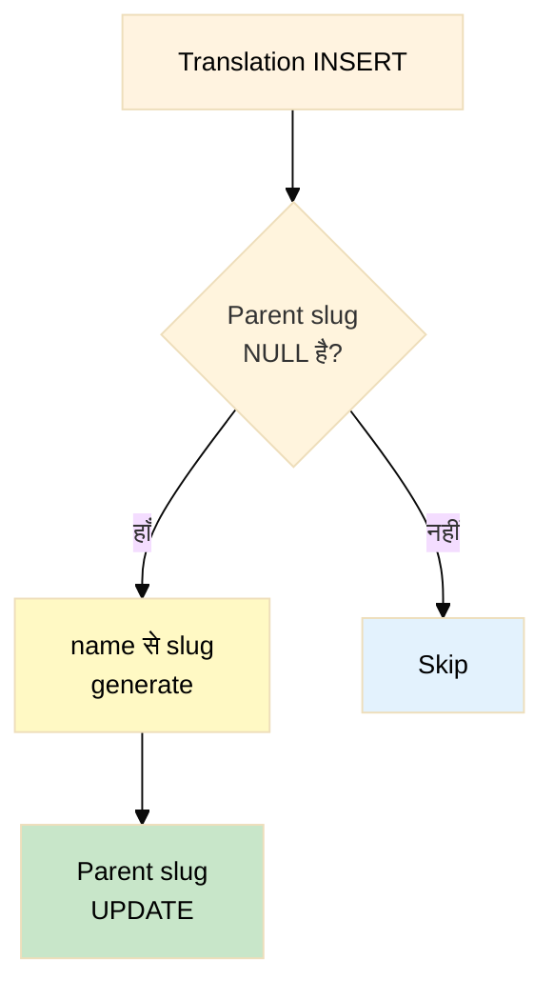

**Parameters:** TG_ARGV[0] = parent table, TG_ARGV[1] = FK column, TG_ARGV[2] = source column

**Scenario:** Category code='WD', slug=NULL → Hindi translation name='वेब डेवलपमेंट' add → trigger fire → slug = 'web-development'

---

### Function 6: `fn_courses_pricing_sync()` — Pricing Auto-Calculate

**मकसद:** Course में 3 pricing fields — **original_price, discount_percentage, price**। किसी भी **2 दो, 3rd automatic** calculate।

**Type:** Trigger Function — BEFORE INSERT OR UPDATE
**कहाँ attach:** courses table

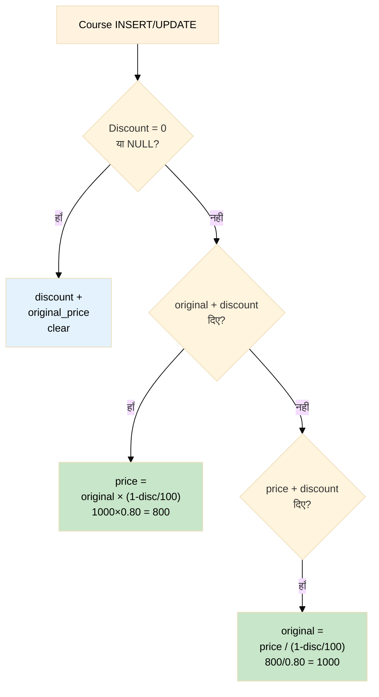

**Guards:** discount **0-100** बीच और original_price **> 0** — बाहर हो तो error।

| original_price | discount | price (auto) |
|---------------|----------|-------------|
| 1000 | 20% | **800** |
| **(auto) 1000** | 20% | 800 |
| 500 | 0% | 500 (discount clear) |

---

## File 06 — 06_register_helper.sql (Trigger Attach Helper)

### मकसद

Helper function जो **एक call में दो काम** — trigger attach + summary row seed। बिना इसके manually करना पड़ता।

### Function: register_summary_trigger

**Input:** Table का नाम
**Output:** Message (TEXT)

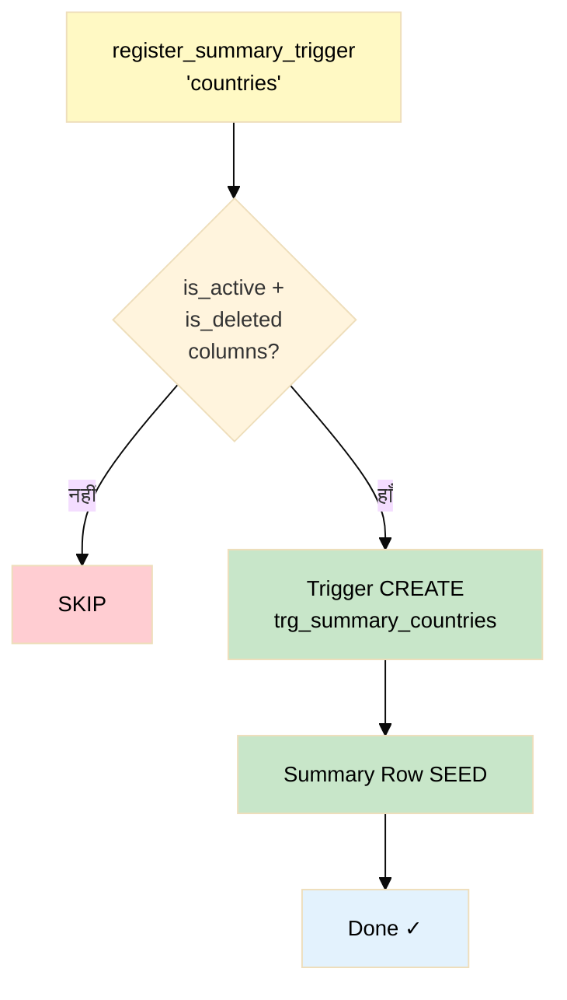

**Safety Check** — information_schema.columns से is_active और is_deleted check करता है। नहीं मिले → skip (बिना error)। table_summary जैसी tables automatically skip होती हैं।

**Trigger** — `trg_summary_{table}` AFTER INSERT OR UPDATE पर fn_manage_table_summary call करता है।

---

## File 07 — 07_auto_register_event_trigger.sql (जादू की छड़ी)

### मकसद

**पूरे system का magic** — इसके बाद कभी manually register नहीं करना पड़ता। जब भी **CREATE TABLE** चले, सब automatic।

### Event Trigger: trg_auto_register_summary_on_create

ये **Event Trigger** है — normal trigger से अलग। Normal trigger DATA changes पर fire होता है। Event Trigger **STRUCTURE changes** (CREATE TABLE) पर fire होता है।

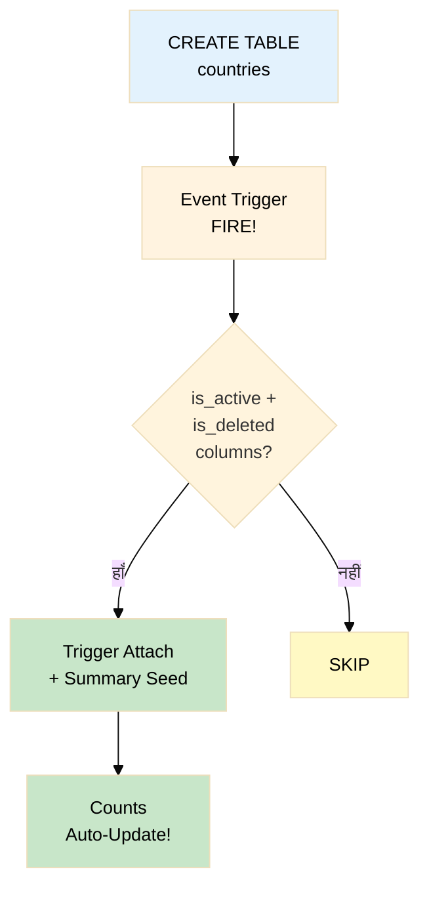

### Automation Flow

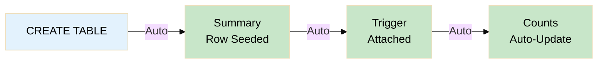

**"Set it and forget it"** — File 07 एक बार run, बाक़ी Phase 01, 02, 03... सब tables की counting automatic।

---

## File 08 — 08_sync_repair.sql (Repair Tools)

### मकसद

Triggers reliable हैं, पर कुछ situations में fire नहीं होते — **COPY** import, **pg_restore**, **server crash**। Counts गलत हो सकते हैं। ये file **repair tools** देती है।

### Function 1: sync_table_summary — एक Table Fix

Source table scan → actual counts calculate (COUNT FILTER — single scan, efficient) → table_summary में UPSERT।

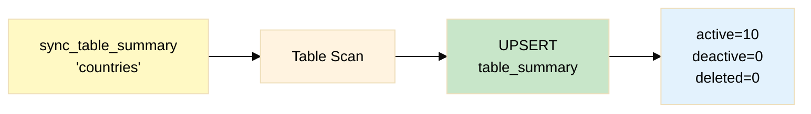

### Function 2: sync_all_table_summaries — सब Fix

हर table sync + **orphan rows cleanup** (dropped tables की बची summary rows delete)।

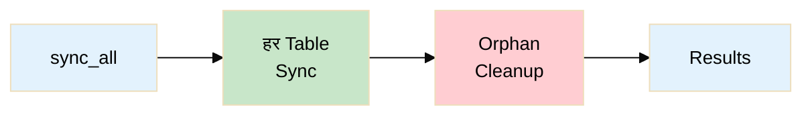

### कब Use करें?

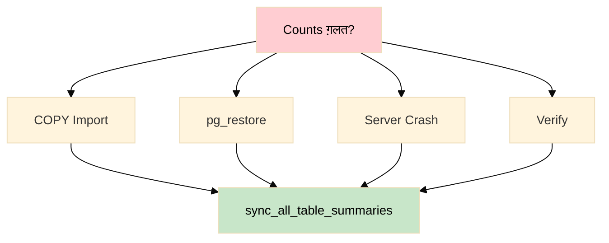

---

## File 09 — 09_dashboard_view.sql (Admin Dashboard)

### मकसद

**View** = saved query। कोई नई table नहीं, बस shortcut। लंबी query की जगह छोटा नाम।

### View: vw_dashboard_summary

table_summary की सारी rows — table_name, is_active, is_deactive, is_deleted, total, updated_at। **Alphabetical order** में sorted।

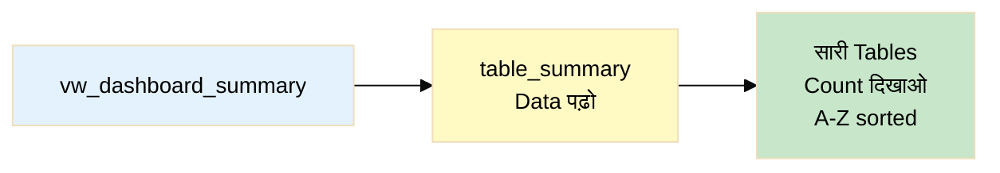

**Use:** Admin dashboard, monitoring, health check, reporting।

---

## File 10 — 10_cron_sync_job.sql (Weekly Safety Net)

### मकसद

**हर Monday 01:00 AM IST** पर sync_all_table_summaries automatically चलाता है। Safety net — अगर कोई issue हुआ, Monday को automatic fix।

### Cron Job: weekly_sync_table_summary

**Schedule:** `0 1 * * 1` — Monday 01:00 AM IST
**Action:** sync_all_table_summaries — tables sync + orphan cleanup

```mermaid
%%{init: {'theme': 'base', 'themeVariables': {'fontSize': '16px', 'fontFamily': 'arial'}}}%%
flowchart LR
    A["Monday<br/>01:00 AM"] -->|"pg_cron"| B["sync_all"]
    B --> C["Tables<br/>Sync"]
    C --> D["Orphan<br/>Cleanup"]
    D --> E["Tuesday<br/>सब Fresh!"]

    style A fill:#f3e5f5,color:#000
    style B fill:#fff9c4,color:#000
    style C fill:#c8e6c9,color:#000
    style D fill:#ffcdd2,color:#000
    style E fill:#e3f2fd,color:#000
```

- **Supabase** पर काम करता है (pg_cron supported)
- **Local** पर skip (gracefully, no error)
- **Idempotent** — कितनी बार run करो, duplicate job नहीं बनेगी

---

## पूरे System का Complete Flow

```mermaid
%%{init: {'theme': 'base', 'themeVariables': {'fontSize': '16px', 'fontFamily': 'arial'}}}%%
flowchart TD
    subgraph SETUP["एक बार Setup — Files 00-10"]
        S0["Timezone IST"] --> S1["7 Extensions ON"]
        S1 --> S2["table_summary बनी"]
        S2 --> S3["6 Core Functions बने"]
        S3 --> S4["Event Trigger Active"]
        S4 --> S5["Dashboard View Ready"]
        S5 --> S6["Cron Job Scheduled"]
    end

    subgraph AUTO["अब सब Automatic — Phase 01+"]
        A1["CREATE TABLE countries<br/>(is_active, is_deleted)"]
        A1 --> A2["Summary Row Seeded"]
        A2 --> A3["Counting Trigger Attached"]
        A3 --> A4["updated_at Trigger Attached"]
        A4 --> A5["INSERT/UPDATE →<br/>Counts Auto-Update"]
    end

    subgraph MON["Monitoring & Safety"]
        M1["vw_dashboard_summary<br/>Instant Overview"]
        M2["Monday 01:00 AM<br/>Auto Sync + Cleanup"]
    end

    SETUP --> AUTO
    AUTO --> MON

    style SETUP fill:#e8f5e9,color:#000
    style AUTO fill:#e3f2fd,color:#000
    style MON fill:#fff9c4,color:#000
```

---

## सभी Objects की Complete List

### Table

| नाम | File | काम |
|-----|------|-----|
| table_summary | 03 | हर table के active, deactive, deleted counts store करता है |

### Functions

| नाम | File | Type | काम |
|-----|------|------|-----|
| seed_summary_row | 04 | VOID | table_summary में ख़ाली row ensure करता है |
| update_updated_at_column | 05 | Trigger | UPDATE पर updated_at = NOW() set करता है |
| fn_manage_table_summary | 05 | Trigger | INSERT/UPDATE पर counts update करता है |
| generate_slug | 05 | Utility (IMMUTABLE) | Text → URL-friendly slug convert करता है |
| fn_auto_slug | 05 | Trigger | Record create/update पर slug auto-generate |
| fn_backfill_slug | 05 | Trigger | Translation insert पर parent slug भरता है |
| fn_courses_pricing_sync | 05 | Trigger | 2 pricing fields से 3rd auto-calculate |
| register_summary_trigger | 06 | TEXT | एक call में trigger attach + row seed |
| fn_auto_register_summary_on_create | 07 | Event Trigger | CREATE TABLE पर automatic register |
| sync_table_summary | 08 | TEXT | एक table counts sync |
| sync_all_table_summaries | 08 | TABLE | सारी tables sync + orphan cleanup |

### Event Trigger

| नाम | File | कब Fire |
|-----|------|---------|
| trg_auto_register_summary_on_create | 07 | CREATE TABLE पर |

### Auto-Created Triggers

| Pattern | कब Fire |
|---------|---------|
| trg_summary_{table} | AFTER INSERT OR UPDATE |
| trg_{table}_updated_at | BEFORE UPDATE |

### View

| नाम | File | काम |
|-----|------|-----|
| vw_dashboard_summary | 09 | table_summary dashboard shortcut |

### Indexes (table_summary पर)

| नाम | Type | काम |
|-----|------|-----|
| uq_table_summary_name | UNIQUE | Duplicate table name रोकता है |
| idx_table_summary_name_trgm | GIN | Fuzzy search |
| idx_table_summary_active | Partial B-tree | Active > 0 filter |
| idx_table_summary_deleted | Partial B-tree | Deleted > 0 filter |
| idx_table_summary_updated_at | B-tree DESC | Recent first |

### Extensions

| नाम | काम | Availability |
|-----|-----|-------------|
| citext | Case-insensitive text | Local + Supabase |
| pg_trgm | Fuzzy search | Local + Supabase |
| pg_trgm | Multilingual full-text search | Supabase only |
| pgcrypto | Password hashing, UUID | Local + Supabase |
| pg_stat_statements | Query statistics | Supabase only |
| unaccent | Accent removal for slugs | Local + Supabase |
| pg_cron | Scheduled jobs | Supabase only |

### Cron Job

| नाम | Schedule | काम |
|-----|----------|-----|
| weekly_sync_table_summary | Monday 01:00 AM IST | Auto sync + cleanup |

---

## Developer के लिए सारांश

Phase 00 के बाद बस इतना करना है:

**Table बनाओ** — `is_active` (BOOLEAN) और `is_deleted` (BOOLEAN) columns रखो। Summary row, counting trigger — **सब automatic**।

**Slug tables** — `slug` column है तो `fn_auto_slug()` trigger attach करो 01_table.sql में। Slug **automatic** generate।

**Pricing tables** — original_price, discount_percentage, price fields → `fn_courses_pricing_sync()` trigger। **2 दो, 3rd automatic**।

**Dashboard** — `vw_dashboard_summary` से हर table count **एक नज़र** में।

**Repair** — Monday 01:00 AM automatic। Urgent → manually `sync_all_table_summaries()` call करो।

**Phase 00 एक बार run** → Phase 01, 02, 03... सब इसी **नींव** पर खड़े।
