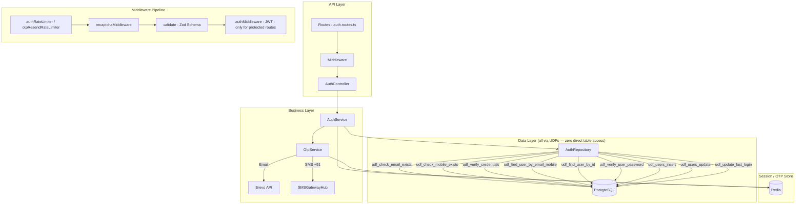

# GrowUpMore API — Authentication Module

## Postman Testing Guide

**Base URL:** `http://localhost:5001`
**API Prefix:** `/api/v1/auth`
**Content-Type:** `application/json`
**Authentication:** Endpoints marked 🔒 require `Bearer <access_token>` in Authorization header

---

## Architecture Flow



---

## Complete Endpoint Reference

### Test Order (follow this sequence in Postman)

| # | Endpoint | Auth | Purpose |
|---|----------|------|---------|
| 1 | `POST /auth/register/initiate` | Public | Start registration — sends OTPs to email + mobile |
| 2 | `POST /auth/register/verify-otp` | Public | Verify both OTPs — creates user account |
| 3 | `POST /auth/register/resend-otp` | Public | Resend registration OTPs |
| 4 | `POST /auth/login` | Public | Login with email + password |
| 5 | `POST /auth/refresh` | Public | Get new access token using refresh token |
| 6 | `POST /auth/logout` | 🔒 | Logout — revokes session |
| 7 | `POST /auth/forgot-password/initiate` | Public | Start password reset — sends OTPs |
| 8 | `POST /auth/forgot-password/verify-otp` | Public | Verify OTPs — returns reset token |
| 9 | `POST /auth/forgot-password/reset-password` | Public | Set new password using reset token |
| 10 | `POST /auth/forgot-password/resend-otp` | Public | Resend password reset OTPs |
| 11 | `POST /auth/change-password/initiate` | 🔒 | Start password change — verifies old password, sends OTPs |
| 12 | `POST /auth/change-password/verify-otp` | 🔒 | Verify OTPs — changes password, forces logout |
| 13 | `POST /auth/change-password/resend-otp` | 🔒 | Resend change password OTPs |
| 14 | `POST /auth/change-email/initiate` | 🔒 | Start email change — sends OTP to new email |
| 15 | `POST /auth/change-email/verify-otp` | 🔒 | Verify OTP — changes email, forces logout |
| 16 | `POST /auth/change-email/resend-otp` | 🔒 | Resend change email OTP |
| 17 | `POST /auth/change-mobile/initiate` | 🔒 | Start mobile change — sends OTP to new mobile |
| 18 | `POST /auth/change-mobile/verify-otp` | 🔒 | Verify OTP — changes mobile, forces logout |
| 19 | `POST /auth/change-mobile/resend-otp` | 🔒 | Resend change mobile OTP |

---

## Prerequisites

Before testing, ensure:

1. **Server running** on `http://localhost:5001`
2. **PostgreSQL** with all UDFs deployed (phase-01 SQL files)
3. **Redis** running (Upstash or local) for sessions, OTPs, pending sessions
4. **Environment variables** set: `BREVO_API_KEY`, `SMS_API_KEY`, `JWT_ACCESS_SECRET`, `JWT_REFRESH_SECRET`
5. **reCAPTCHA** (optional): Set `RECAPTCHA_ENABLED=true` in `.env` to enforce (see reCAPTCHA section below)

---

## Important Rules

### OTP Rules
- OTP is sent to both email (via Brevo) and mobile (via SMSGatewayHub with `+91` prefix)
- **Cooldown**: 3 minutes between resend attempts
- **Max resends**: 3 total per OTP session window
- **Max verification attempts**: Configurable via `OTP_MAX_ATTEMPTS` env var
- OTP length: Configurable via `OTP_LENGTH` env var (default 4–8 digits)

### Mobile Validation
- Must be exactly **10 digits** (Indian format)
- SMS is sent with `91` country code prefix (e.g., `919876543210`)
- Do NOT include `+91` — only pass `9876543210`

### Password Validation
- 8–128 characters
- Must contain at least one uppercase letter, one lowercase letter, and one digit

### Rate Limiting
| Limiter | Window | Max Requests | Applied To |
|---------|--------|-------------|------------|
| **Global** | `RATE_LIMIT_WINDOW_MS` | `RATE_LIMIT_MAX` | All API routes |
| **Auth** | `RATE_LIMIT_WINDOW_MS` | `RATE_LIMIT_AUTH_MAX` | initiate, verify-otp, login, refresh |
| **OTP Resend** | 15 minutes | 5 | All resend-otp endpoints |

### reCAPTCHA (Toggleable)

reCAPTCHA is **manually toggleable** via the `RECAPTCHA_ENABLED` environment variable.

| `RECAPTCHA_ENABLED` | `NODE_ENV` | Behavior |
|---------------------|------------|----------|
| `false` (default) | Any | **Skipped** — no `recaptchaToken` needed in request body |
| `true` | `production` | **Enforced** — `recaptchaToken` required on protected endpoints |
| `true` | `development` / `test` | **Skipped** — auto-skipped in non-production regardless of toggle |

**Endpoints that use reCAPTCHA:**
- `POST /auth/register/initiate` — action: `REGISTER`
- `POST /auth/login` — action: `LOGIN`

**When `RECAPTCHA_ENABLED=false` (default):**
- Do NOT send `recaptchaToken` in the request body (or send it — it will be ignored)
- The middleware auto-skips and returns `{ success: true, score: 1, skipped: true }`

**When `RECAPTCHA_ENABLED=true` (production):**
- You MUST send `"recaptchaToken": "<token>"` in the request body
- The token is verified against Google reCAPTCHA Enterprise API
- Score must be ≥ `RECAPTCHA_MIN_SCORE` (default: 0.5)

**To toggle on the server:**
```bash
# In /var/www/api/.env — change this line:
RECAPTCHA_ENABLED=true    # enforce reCAPTCHA
RECAPTCHA_ENABLED=false   # skip reCAPTCHA (default)

# Then restart:
pm2 restart growupmore-api
```

**Related env variables (only needed when `RECAPTCHA_ENABLED=true`):**
```env
RECAPTCHA_ENABLED=false
RECAPTCHA_SITE_KEY=6Leo8FYs...
RECAPTCHA_SECRET_KEY=6Leo8FYs...
RECAPTCHA_API_KEY=AIzaSyAK...
RECAPTCHA_PROJECT_ID=growupmore
RECAPTCHA_MIN_SCORE=0.5
```

---

## 1. REGISTRATION

### 1.1 Register — Initiate

**`POST /api/v1/auth/register/initiate`**

**Headers:**
```
Content-Type: application/json
```

**Body — Student registration (default):**
```json
{
  "firstName": "Girish",
  "lastName": "Kumar",
  "email": "girish@example.com",
  "mobile": "9876543210",
  "password": "SecurePass1"
}
```

**Body — Instructor registration:**
```json
{
  "firstName": "Girish",
  "lastName": "Kumar",
  "email": "girish@example.com",
  "mobile": "9876543210",
  "password": "SecurePass1",
  "roleCode": "instructor"
}
```

**Body — with reCAPTCHA (`RECAPTCHA_ENABLED=true`):**
```json
{
  "firstName": "Girish",
  "lastName": "Kumar",
  "email": "girish@example.com",
  "mobile": "9876543210",
  "password": "SecurePass1",
  "roleCode": "instructor",
  "recaptchaToken": "03AGdBq24..."
}
```

**Success Response (200):**
```json
{
  "success": true,
  "message": "OTPs sent for registration",
  "data": {
    "sessionKey": "a1b2c3d4e5f6a1b2c3d4e5f6a1b2c3d4e5f6a1b2c3d4e5f6",
    "message": "OTPs sent to your email and mobile. Please verify to complete registration."
  }
}
```

**Postman Tests:**
```javascript
pm.test("Status is 200", () => pm.response.to.have.status(200));
const json = pm.response.json();
pm.test("Has sessionKey", () => pm.expect(json.data.sessionKey).to.be.a("string"));
pm.collectionVariables.set("registerSessionKey", json.data.sessionKey);
```

**Error Responses:**

*Email already registered (409):*
```json
{
  "success": false,
  "message": "Email is already registered.",
  "code": "EMAIL_ALREADY_EXISTS"
}
```

*Mobile already registered (409):*
```json
{
  "success": false,
  "message": "Mobile number is already registered.",
  "code": "MOBILE_ALREADY_EXISTS"
}
```

*Validation error (400):*
```json
{
  "success": false,
  "message": "Validation error",
  "errors": [
    { "field": "mobile", "message": "Mobile number must be exactly 10 digits." },
    { "field": "password", "message": "Password must include upper, lower, and number." },
    { "field": "firstName", "message": "String must contain at least 2 character(s)" }
  ]
}
```

*reCAPTCHA token missing — only when `RECAPTCHA_ENABLED=true` (400):*
```json
{
  "success": false,
  "message": "reCAPTCHA token is required",
  "code": "RECAPTCHA_TOKEN_MISSING",
  "details": null
}
```

*reCAPTCHA verification failed — only when `RECAPTCHA_ENABLED=true` (403):*
```json
{
  "success": false,
  "message": "reCAPTCHA verification failed",
  "code": "RECAPTCHA_INVALID",
  "details": null
}
```

*reCAPTCHA score too low — suspected bot (403):*
```json
{
  "success": false,
  "message": "reCAPTCHA verification failed — suspected bot",
  "code": "RECAPTCHA_LOW_SCORE",
  "details": null
}
```

*Rate limit exceeded (429):*
```json
{
  "success": false,
  "message": "Too many authentication attempts. Please try again later.",
  "code": "AUTH_RATE_LIMIT_EXCEEDED"
}
```

---

### 1.2 Register — Verify OTP

**`POST /api/v1/auth/register/verify-otp`**

**Headers:**
```
Content-Type: application/json
```

**Body (JSON):**
```json
{
  "sessionKey": "{{registerSessionKey}}",
  "emailOtp": "1234",
  "mobileOtp": "5678"
}
```

**Success Response (201):**
```json
{
  "success": true,
  "message": "User registered successfully",
  "data": {
    "user": {
      "id": 1,
      "firstName": "Girish",
      "lastName": "Kumar",
      "email": "girish@example.com",
      "mobile": "9876543210",
      "isActive": true,
      "isEmailVerified": true,
      "isMobileVerified": true,
      "lastLogin": null,
      "createdAt": "2026-04-08T12:00:00.000Z",
      "updatedAt": "2026-04-08T12:00:00.000Z"
    },
    "tokens": {
      "accessToken": "eyJhbGciOiJIUzI1NiIs...",
      "refreshToken": "eyJhbGciOiJIUzI1NiIs..."
    }
  }
}
```

**Postman Tests:**
```javascript
pm.test("Status is 201", () => pm.response.to.have.status(201));
const json = pm.response.json();
pm.test("Has user data", () => pm.expect(json.data.user.id).to.be.a("number"));
pm.test("Has tokens", () => pm.expect(json.data.tokens.accessToken).to.be.a("string"));
pm.collectionVariables.set("access_token", json.data.tokens.accessToken);
pm.collectionVariables.set("refresh_token", json.data.tokens.refreshToken);
pm.collectionVariables.set("userId", json.data.user.id);
```

**Error Responses:**

*Session expired or invalid (400):*
```json
{
  "success": false,
  "message": "Registration session expired or invalid. Please start over.",
  "code": "SESSION_EXPIRED"
}
```

*Invalid OTP (400):*
```json
{
  "success": false,
  "message": "Invalid email OTP. X attempts remaining.",
  "code": "INVALID_OTP"
}
```

*Email taken during verification — race condition (409):*
```json
{
  "success": false,
  "message": "Email was registered by another user during verification.",
  "code": "EMAIL_ALREADY_EXISTS"
}
```

*Mobile taken during verification — race condition (409):*
```json
{
  "success": false,
  "message": "Mobile was registered by another user during verification.",
  "code": "MOBILE_ALREADY_EXISTS"
}
```

---

### 1.3 Register — Resend OTP

**`POST /api/v1/auth/register/resend-otp`**

**Headers:**
```
Content-Type: application/json
```

**Body (JSON):**
```json
{
  "sessionKey": "{{registerSessionKey}}"
}
```

**Success Response (200):**
```json
{
  "success": true,
  "message": "OTPs resent",
  "data": {
    "message": "OTPs resent to your email and mobile."
  }
}
```

**Error Responses:**

*Session expired (400):*
```json
{
  "success": false,
  "message": "Registration session expired or invalid. Please start over.",
  "code": "SESSION_EXPIRED"
}
```

*OTP cooldown active (429):*
```json
{
  "success": false,
  "message": "Please wait before requesting a new OTP.",
  "code": "OTP_COOLDOWN"
}
```

*Max resends reached (429):*
```json
{
  "success": false,
  "message": "Maximum OTP resend attempts reached. Please start a new session.",
  "code": "MAX_RESENDS_REACHED"
}
```

*Rate limit exceeded (429):*
```json
{
  "success": false,
  "message": "Too many OTP requests. Please try again after some time.",
  "code": "OTP_RATE_LIMIT_EXCEEDED"
}
```

---

## 2. LOGIN / REFRESH / LOGOUT

### 2.1 Login

**`POST /api/v1/auth/login`**

**Headers:**
```
Content-Type: application/json
```

**Body — when `RECAPTCHA_ENABLED=false` (default / Postman testing):**
```json
{
  "email": "girish@example.com",
  "password": "SecurePass1"
}
```

**Body — when `RECAPTCHA_ENABLED=true` (production with reCAPTCHA enforced):**
```json
{
  "email": "girish@example.com",
  "password": "SecurePass1",
  "recaptchaToken": "03AGdBq24..."
}
```

**Success Response (200):**
```json
{
  "success": true,
  "message": "Login successful",
  "data": {
    "user": {
      "id": 1,
      "firstName": "Girish",
      "lastName": "Kumar",
      "email": "girish@example.com",
      "mobile": "9876543210",
      "isActive": true,
      "isEmailVerified": true,
      "isMobileVerified": true,
      "lastLogin": "2026-04-08T12:00:00.000Z",
      "createdAt": "2026-04-08T10:00:00.000Z",
      "updatedAt": "2026-04-08T12:00:00.000Z"
    },
    "tokens": {
      "accessToken": "eyJhbGciOiJIUzI1NiIs...",
      "refreshToken": "eyJhbGciOiJIUzI1NiIs..."
    }
  }
}
```

**Postman Tests:**
```javascript
pm.test("Status is 200", () => pm.response.to.have.status(200));
const json = pm.response.json();
pm.test("Login successful", () => pm.expect(json.data.tokens.accessToken).to.be.a("string"));
pm.collectionVariables.set("access_token", json.data.tokens.accessToken);
pm.collectionVariables.set("refresh_token", json.data.tokens.refreshToken);
```

**Error Responses:**

*Invalid credentials (401):*
```json
{
  "success": false,
  "message": "Invalid email or password.",
  "code": "INVALID_CREDENTIALS"
}
```

*Account deactivated (403):*
```json
{
  "success": false,
  "message": "Your account has been deactivated.",
  "code": "ACCOUNT_DEACTIVATED"
}
```

---

### 2.2 Refresh Token

**`POST /api/v1/auth/refresh`**

**Headers:**
```
Content-Type: application/json
```

**Body (JSON):**
```json
{
  "refreshToken": "{{refresh_token}}"
}
```

**Success Response (200):**
```json
{
  "success": true,
  "message": "Token refreshed",
  "data": {
    "user": {
      "id": 1,
      "firstName": "Girish",
      "lastName": "Kumar",
      "email": "girish@example.com",
      "mobile": "9876543210",
      "isActive": true,
      "isEmailVerified": true,
      "isMobileVerified": true,
      "lastLogin": "2026-04-08T12:00:00.000Z",
      "createdAt": "2026-04-08T10:00:00.000Z",
      "updatedAt": "2026-04-08T12:00:00.000Z"
    },
    "tokens": {
      "accessToken": "eyJhbGciOiJIUzI1NiIs...",
      "refreshToken": "eyJhbGciOiJIUzI1NiIs..."
    }
  }
}
```

**Error Responses:**

*Invalid or expired refresh token (401):*
```json
{
  "success": false,
  "message": "Invalid or expired refresh token.",
  "code": "INVALID_REFRESH_TOKEN"
}
```

*Refresh token revoked (401):*
```json
{
  "success": false,
  "message": "Refresh token has been revoked.",
  "code": "REFRESH_TOKEN_REVOKED"
}
```

*User not found (404):*
```json
{
  "success": false,
  "message": "User not found.",
  "code": "USER_NOT_FOUND"
}
```

*Account deactivated (403):*
```json
{
  "success": false,
  "message": "Your account has been deactivated.",
  "code": "ACCOUNT_DEACTIVATED"
}
```

---

### 2.3 Logout

**`POST /api/v1/auth/logout`** 🔒

**Headers:**
```
Authorization: Bearer {{access_token}}
```

**No body required.**

**Success Response (200):**
```json
{
  "success": true,
  "message": "Logged out successfully",
  "data": {
    "message": "Logged out successfully."
  }
}
```

**Error Responses:**

*Unauthorized (401):*
```json
{
  "success": false,
  "message": "Access token is missing or invalid"
}
```

---

## 3. FORGOT PASSWORD

### 3.1 Forgot Password — Initiate

**`POST /api/v1/auth/forgot-password/initiate`**

**Headers:**
```
Content-Type: application/json
```

**Body (JSON):**
```json
{
  "email": "girish@example.com",
  "mobile": "9876543210"
}
```

> **Note:** Both email and mobile must belong to the same account.

**Success Response (200):**
```json
{
  "success": true,
  "message": "OTPs sent for password reset",
  "data": {
    "sessionKey": "f1e2d3c4b5a6f1e2d3c4b5a6f1e2d3c4b5a6f1e2d3c4b5a6",
    "message": "OTPs sent to your email and mobile. Please verify to reset your password."
  }
}
```

**Postman Tests:**
```javascript
pm.test("Status is 200", () => pm.response.to.have.status(200));
const json = pm.response.json();
pm.collectionVariables.set("forgotPasswordSessionKey", json.data.sessionKey);
```

**Error Responses:**

*No account found (404):*
```json
{
  "success": false,
  "message": "No account found with this email and mobile combination.",
  "code": "USER_NOT_FOUND"
}
```

*Account deactivated (403):*
```json
{
  "success": false,
  "message": "Your account has been deactivated.",
  "code": "ACCOUNT_DEACTIVATED"
}
```

---

### 3.2 Forgot Password — Verify OTP

**`POST /api/v1/auth/forgot-password/verify-otp`**

**Headers:**
```
Content-Type: application/json
```

**Body (JSON):**
```json
{
  "sessionKey": "{{forgotPasswordSessionKey}}",
  "emailOtp": "1234",
  "mobileOtp": "5678"
}
```

**Success Response (200):**
```json
{
  "success": true,
  "message": "OTPs verified",
  "data": {
    "resetToken": "f1e2d3c4b5a6f1e2d3c4b5a6f1e2d3c4b5a6f1e2d3c4b5a6",
    "message": "OTPs verified. Please set your new password."
  }
}
```

> **Note:** `resetToken` is valid for **10 minutes**. Use it in the next step.

**Postman Tests:**
```javascript
pm.test("Status is 200", () => pm.response.to.have.status(200));
const json = pm.response.json();
pm.collectionVariables.set("resetToken", json.data.resetToken);
```

**Error Responses:**

*Session expired (400):*
```json
{
  "success": false,
  "message": "Password reset session expired or invalid. Please start over.",
  "code": "SESSION_EXPIRED"
}
```

*Invalid OTP (400):*
```json
{
  "success": false,
  "message": "Invalid email OTP. X attempts remaining.",
  "code": "INVALID_OTP"
}
```

---

### 3.3 Forgot Password — Reset Password

**`POST /api/v1/auth/forgot-password/reset-password`**

**Headers:**
```
Content-Type: application/json
```

**Body (JSON):**
```json
{
  "resetToken": "{{resetToken}}",
  "newPassword": "NewSecure1"
}
```

**Success Response (200):**
```json
{
  "success": true,
  "message": "Password reset successfully",
  "data": {
    "message": "Password reset successfully. Please login with your new password."
  }
}
```

> **Note:** All existing sessions are revoked — user must login again with the new password.

**Error Responses:**

*Reset token expired (400):*
```json
{
  "success": false,
  "message": "Reset token expired or invalid. Please start the process again.",
  "code": "SESSION_EXPIRED"
}
```

*Validation error (400):*
```json
{
  "success": false,
  "message": "Validation error",
  "errors": [
    { "field": "newPassword", "message": "Password must include upper, lower, and number." }
  ]
}
```

---

### 3.4 Forgot Password — Resend OTP

**`POST /api/v1/auth/forgot-password/resend-otp`**

**Headers:**
```
Content-Type: application/json
```

**Body (JSON):**
```json
{
  "sessionKey": "{{forgotPasswordSessionKey}}"
}
```

**Success Response (200):**
```json
{
  "success": true,
  "message": "OTPs resent",
  "data": {
    "message": "OTPs resent to your email and mobile."
  }
}
```

**Error Responses:** Same as Register — Resend OTP (Session expired, OTP cooldown, Max resends, Rate limit).

---

## 4. CHANGE PASSWORD (Authenticated)

### 4.1 Change Password — Initiate

**`POST /api/v1/auth/change-password/initiate`** 🔒

**Headers:**
```
Authorization: Bearer {{access_token}}
Content-Type: application/json
```

**Body (JSON):**
```json
{
  "oldPassword": "SecurePass1",
  "newPassword": "NewSecure2"
}
```

**Success Response (200):**
```json
{
  "success": true,
  "message": "OTPs sent for password change",
  "data": {
    "sessionKey": "c1d2e3f4a5b6c1d2e3f4a5b6c1d2e3f4a5b6c1d2e3f4a5b6",
    "message": "OTPs sent to your email and mobile. Please verify to change your password."
  }
}
```

**Postman Tests:**
```javascript
pm.test("Status is 200", () => pm.response.to.have.status(200));
const json = pm.response.json();
pm.collectionVariables.set("changePasswordSessionKey", json.data.sessionKey);
```

**Error Responses:**

*Current password incorrect (401):*
```json
{
  "success": false,
  "message": "Current password is incorrect.",
  "code": "INVALID_PASSWORD"
}
```

*User not found (404):*
```json
{
  "success": false,
  "message": "User not found.",
  "code": "USER_NOT_FOUND"
}
```

*Missing contact info (400):*
```json
{
  "success": false,
  "message": "Both email and mobile are required for password change.",
  "code": "MISSING_CONTACT_INFO"
}
```

---

### 4.2 Change Password — Verify OTP

**`POST /api/v1/auth/change-password/verify-otp`** 🔒

**Headers:**
```
Authorization: Bearer {{access_token}}
Content-Type: application/json
```

**Body (JSON):**
```json
{
  "sessionKey": "{{changePasswordSessionKey}}",
  "emailOtp": "1234",
  "mobileOtp": "5678"
}
```

**Success Response (200):**
```json
{
  "success": true,
  "message": "Password changed successfully",
  "data": {
    "message": "Password changed successfully. Please login with your new password."
  }
}
```

> **Note:** All sessions are revoked (force logout). The access token used for this request is no longer valid after this call.

**Error Responses:** Session expired (400), Invalid OTP (400).

---

### 4.3 Change Password — Resend OTP

**`POST /api/v1/auth/change-password/resend-otp`** 🔒

**Headers:**
```
Authorization: Bearer {{access_token}}
Content-Type: application/json
```

**Body (JSON):**
```json
{
  "sessionKey": "{{changePasswordSessionKey}}"
}
```

**Success Response (200):**
```json
{
  "success": true,
  "message": "OTPs resent",
  "data": {
    "message": "OTPs resent to your email and mobile."
  }
}
```

**Error Responses:** Session expired (400), OTP cooldown (429), Max resends (429).

---

## 5. CHANGE EMAIL (Authenticated)

### 5.1 Change Email — Initiate

**`POST /api/v1/auth/change-email/initiate`** 🔒

**Headers:**
```
Authorization: Bearer {{access_token}}
Content-Type: application/json
```

**Body (JSON):**
```json
{
  "newEmail": "girish.new@example.com"
}
```

**Success Response (200):**
```json
{
  "success": true,
  "message": "OTP sent for email change",
  "data": {
    "sessionKey": "d1e2f3a4b5c6d1e2f3a4b5c6d1e2f3a4b5c6d1e2f3a4b5c6",
    "message": "OTP sent to your new email. Please verify to complete the change."
  }
}
```

> **Note:** OTP is sent only to the **new** email address.

**Postman Tests:**
```javascript
pm.test("Status is 200", () => pm.response.to.have.status(200));
const json = pm.response.json();
pm.collectionVariables.set("changeEmailSessionKey", json.data.sessionKey);
```

**Error Responses:**

*Email already registered (409):*
```json
{
  "success": false,
  "message": "This email is already registered.",
  "code": "EMAIL_ALREADY_EXISTS"
}
```

---

### 5.2 Change Email — Verify OTP

**`POST /api/v1/auth/change-email/verify-otp`** 🔒

**Headers:**
```
Authorization: Bearer {{access_token}}
Content-Type: application/json
```

**Body (JSON):**
```json
{
  "sessionKey": "{{changeEmailSessionKey}}",
  "emailOtp": "1234"
}
```

> **Note:** Only `emailOtp` is required (no `mobileOtp`) since OTP was sent only to the new email.

**Success Response (200):**
```json
{
  "success": true,
  "message": "Email changed successfully",
  "data": {
    "message": "Email changed successfully. Please login with your new email."
  }
}
```

> **Note:** All sessions are revoked (force logout). User must login again with the new email.

**Error Responses:** Session expired (400), Invalid OTP (400), Email taken during verification (409).

---

### 5.3 Change Email — Resend OTP

**`POST /api/v1/auth/change-email/resend-otp`** 🔒

**Headers:**
```
Authorization: Bearer {{access_token}}
Content-Type: application/json
```

**Body (JSON):**
```json
{
  "sessionKey": "{{changeEmailSessionKey}}"
}
```

**Success Response (200):**
```json
{
  "success": true,
  "message": "OTP resent",
  "data": {
    "message": "OTP resent to your new email."
  }
}
```

**Error Responses:** Session expired (400), OTP cooldown (429), Max resends (429).

---

## 6. CHANGE MOBILE (Authenticated)

### 6.1 Change Mobile — Initiate

**`POST /api/v1/auth/change-mobile/initiate`** 🔒

**Headers:**
```
Authorization: Bearer {{access_token}}
Content-Type: application/json
```

**Body (JSON):**
```json
{
  "newMobile": "9123456789"
}
```

> **Note:** Pass only 10 digits. The system adds `91` prefix for SMS delivery.

**Success Response (200):**
```json
{
  "success": true,
  "message": "OTP sent for mobile change",
  "data": {
    "sessionKey": "e1f2a3b4c5d6e1f2a3b4c5d6e1f2a3b4c5d6e1f2a3b4c5d6",
    "message": "OTP sent to your new mobile. Please verify to complete the change."
  }
}
```

> **Note:** OTP is sent only to the **new** mobile number.

**Postman Tests:**
```javascript
pm.test("Status is 200", () => pm.response.to.have.status(200));
const json = pm.response.json();
pm.collectionVariables.set("changeMobileSessionKey", json.data.sessionKey);
```

**Error Responses:**

*Mobile already registered (409):*
```json
{
  "success": false,
  "message": "This mobile number is already registered.",
  "code": "MOBILE_ALREADY_EXISTS"
}
```

---

### 6.2 Change Mobile — Verify OTP

**`POST /api/v1/auth/change-mobile/verify-otp`** 🔒

**Headers:**
```
Authorization: Bearer {{access_token}}
Content-Type: application/json
```

**Body (JSON):**
```json
{
  "sessionKey": "{{changeMobileSessionKey}}",
  "mobileOtp": "5678"
}
```

> **Note:** Only `mobileOtp` is required (no `emailOtp`) since OTP was sent only to the new mobile.

**Success Response (200):**
```json
{
  "success": true,
  "message": "Mobile changed successfully",
  "data": {
    "message": "Mobile changed successfully. Please login again."
  }
}
```

> **Note:** All sessions are revoked (force logout).

**Error Responses:** Session expired (400), Invalid OTP (400), Mobile taken during verification (409).

---

### 6.3 Change Mobile — Resend OTP

**`POST /api/v1/auth/change-mobile/resend-otp`** 🔒

**Headers:**
```
Authorization: Bearer {{access_token}}
Content-Type: application/json
```

**Body (JSON):**
```json
{
  "sessionKey": "{{changeMobileSessionKey}}"
}
```

**Success Response (200):**
```json
{
  "success": true,
  "message": "OTP resent",
  "data": {
    "message": "OTP resent to your new mobile."
  }
}
```

**Error Responses:** Session expired (400), OTP cooldown (429), Max resends (429).

---

## Postman Collection Variables

| Variable | Initial Value | Description |
|----------|---------------|-------------|
| `baseUrl` | `http://localhost:5001` | API base URL |
| `access_token` | *(from login/register)* | JWT access token |
| `refresh_token` | *(from login/register)* | JWT refresh token |
| `userId` | *(from register)* | Created user ID |
| `registerSessionKey` | *(auto-set)* | Registration session key |
| `forgotPasswordSessionKey` | *(auto-set)* | Forgot password session key |
| `resetToken` | *(auto-set)* | Password reset token (valid 10 min) |
| `changePasswordSessionKey` | *(auto-set)* | Change password session key |
| `changeEmailSessionKey` | *(auto-set)* | Change email session key |
| `changeMobileSessionKey` | *(auto-set)* | Change mobile session key |

---

## Common Error Responses

**Unauthorized (401):**
```json
{
  "success": false,
  "message": "Access token is missing or invalid"
}
```

**Token expired (401):**
```json
{
  "success": false,
  "message": "jwt expired"
}
```

**Validation error (400):**
```json
{
  "success": false,
  "message": "Validation error",
  "errors": [
    { "field": "email", "message": "Invalid email" },
    { "field": "mobile", "message": "Mobile number must be exactly 10 digits." }
  ]
}
```

---

## Database Functions Reference

| Function | Purpose |
|----------|---------|
| `udf_check_email_exists(p_email)` | Returns `{exists: boolean}` |
| `udf_check_mobile_exists(p_mobile)` | Returns `{exists: boolean}` |
| `udf_verify_credentials(p_email, p_password)` | Returns user TABLE if credentials valid |
| `udf_find_user_by_email_mobile(p_email, p_mobile)` | Returns user TABLE matching both |
| `udf_find_user_by_id(p_user_id)` | Returns user TABLE by ID |
| `udf_verify_user_password(p_user_id, p_password)` | Returns `{valid: boolean}` (SECURITY DEFINER) |
| `udf_users_insert(...)` | Creates new user, returns `{success, message, id}` |
| `udf_users_update(...)` | Updates user fields, returns `{success, message}` |
| `udf_update_last_login(p_user_id)` | Updates last_login timestamp, returns `{success, message}` |
