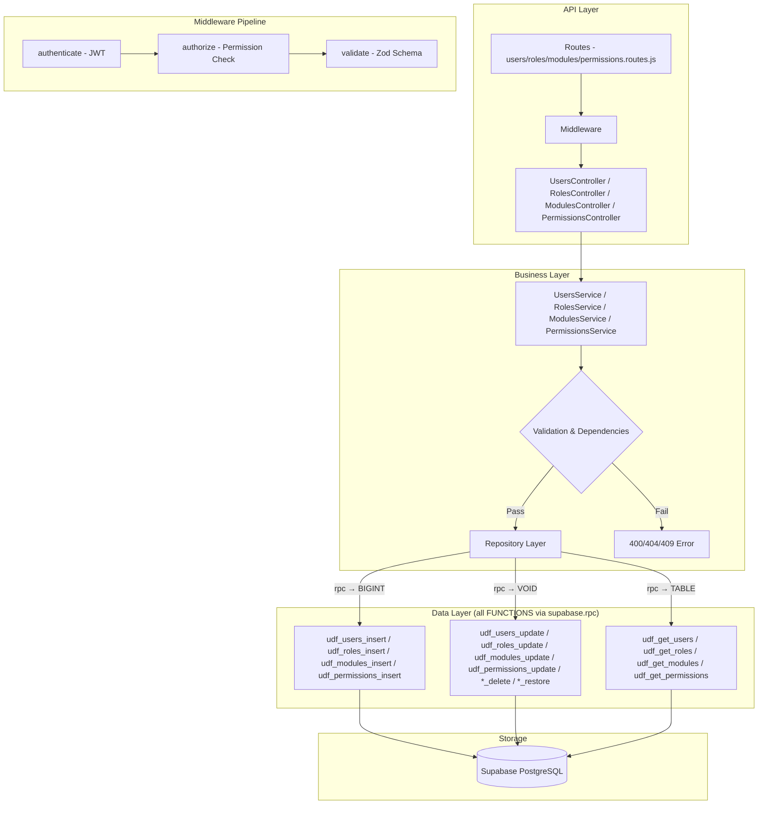

# GrowUpMore API — RBAC (Users, Roles, Modules, Permissions) Module

## Postman Testing Guide

**Base URL:** `http://localhost:5001`
**API Prefix:** `/api/v1`
**Content-Type:** `application/json`
**Authentication:** All endpoints require `Bearer <access_token>` in Authorization header

---

## Architecture Flow



---

## Complete Endpoint Reference

### Test Order (follow this sequence in Postman)

| # | Endpoint | Permission | Purpose |
|---|----------|-----------|---------|
| 1 | `POST /users` | `user.create` | Create a new user |
| 2 | `GET /users` | `user.read` | List all users with filters |
| 3 | `GET /users/:id` | `user.read` | Get a single user by ID |
| 4 | `GET /users/me` | auth only | Get current user profile |
| 5 | `PATCH /users/me` | auth only | Update own profile |
| 6 | `PUT /users/:id` | `user.update` | Update user details |
| 7 | `DELETE /users/:id` | `user.delete` | Soft-delete a user |
| 8 | `PATCH /users/:id/restore` | `user.restore` | Restore a soft-deleted user |
| 9 | `POST /roles` | `role.create` | Create a new role |
| 10 | `GET /roles` | `role.read` | List all roles with filters |
| 11 | `GET /roles/:id` | `role.read` | Get a single role by ID |
| 12 | `PUT /roles/:id` | `role.update` | Update role details |
| 13 | `DELETE /roles/:id` | `role.delete` | Soft-delete a role |
| 14 | `PATCH /roles/:id/restore` | `role.restore` | Restore a soft-deleted role with optional permissions |
| 15 | `POST /modules` | `module.create` | Create a new module |
| 16 | `GET /modules` | `module.read` | List all modules with filters |
| 17 | `GET /modules/:id` | `module.read` | Get a single module by ID |
| 18 | `PUT /modules/:id` | `module.update` | Update module details |
| 19 | `DELETE /modules/:id` | `module.delete` | Soft-delete a module |
| 20 | `PATCH /modules/:id/restore` | `module.restore` | Restore a soft-deleted module |
| 21 | `POST /permissions` | `permission.manage` | Create a new permission |
| 22 | `GET /permissions` | `permission.manage` | List all permissions with filters |
| 23 | `GET /permissions/:id` | `permission.manage` | Get a single permission by ID |
| 24 | `PUT /permissions/:id` | `permission.manage` | Update permission details |
| 25 | `DELETE /permissions/:id` | `permission.manage` | Soft-delete a permission |
| 26 | `PATCH /permissions/:id/restore` | `permission.manage` | Restore a soft-deleted permission |

---

## Prerequisites

Before testing, ensure:

1. **Authentication**: Login via `POST /api/v1/auth/login` to obtain `access_token`
2. **Permissions**: Run RBAC permission seeds in Supabase SQL Editor
3. **Master Data**: Ensure Countries exist (from earlier phases) for user creation

---

## 1. USERS MODULE

### 1.1 Create User

**`POST /api/v1/users`**

**Headers:**
```
Authorization: Bearer {{access_token}}
Content-Type: application/json
```

**Body (JSON):**
```json
{
  "firstName": "Rajesh",
  "lastName": "Kumar",
  "email": "rajesh.kumar@growupmore.com",
  "mobile": "+919876543210",
  "password": "SecurePass123",
  "countryId": 1,
  "roleId": 8
}
```

**Expected Response (201):**
```json
{
  "success": true,
  "message": "User created",
  "data": {
    "id": 1
  }
}
```

**Postman Tests:**
```javascript
pm.test("Status is 201", () => pm.response.to.have.status(201));
const json = pm.response.json();
pm.test("Has user ID", () => pm.expect(json.data.id).to.be.a("number"));
pm.collectionVariables.set("userId", json.data.id);
```

**Validation Rules:**
- `firstName`: trimmed, min 2, max 80 chars
- `lastName`: trimmed, min 1, max 80 chars
- `email`: optional, valid email format, trimmed. Refine: at least one of email/mobile required
- `mobile`: optional, trimmed, 7-20 digits. Refine: at least one of email/mobile required
- `password`: 8-128 chars, must contain uppercase + lowercase + number
- `countryId`: optional, positive integer
- `roleId`: optional, positive integer — assigns a role to the user on creation (see RBAC guards below)
- `isActive`: automatically set to `false` — Super Admin must activate the user
- `isEmailVerified`: automatically set to `false` — user must verify their own email
- `isMobileVerified`: automatically set to `false` — user must verify their own mobile

**RBAC Guards on `roleId`:**
- If `roleId` is not provided, user is created with no role (role can be assigned later via user-role-assignments API)
- **Super Admin** can assign any role (super_admin, admin, student, instructor, etc.)
- **Admin** can assign roles like moderator, content_manager, finance_admin, support_agent — but **cannot** assign super_admin, admin, student, or instructor roles
- If an Admin tries to assign a blocked role, the API returns 403 with appropriate error code

---

### 1.2 Get Current User Profile

**`GET /api/v1/users/me`**

**Headers:**
```
Authorization: Bearer {{access_token}}
```

**Expected Response (200):**
```json
{
  "success": true,
  "message": "Current user fetched",
  "data": {
    "id": 1,
    "countryId": 1,
    "firstName": "Rajesh",
    "lastName": "Kumar",
    "email": "rajesh.kumar@growupmore.com",
    "mobile": "+919876543210",
    "isActive": true,
    "isDeleted": false,
    "isEmailVerified": false,
    "isMobileVerified": false,
    "lastLogin": "2026-04-08T10:30:45.123Z",
    "emailVerifiedAt": null,
    "mobileVerifiedAt": null,
    "createdAt": "2026-04-01T08:00:00.000Z",
    "updatedAt": "2026-04-08T10:30:45.123Z",
    "deletedAt": null,
    "country": {
      "name": "India",
      "iso2": "IN",
      "iso3": "IND",
      "phoneCode": "+91",
      "nationality": "Indian",
      "nationalLanguage": "Hindi",
      "languages": ["Hindi", "English"],
      "currency": "INR",
      "currencyName": "Indian Rupee",
      "currencySymbol": "₹",
      "flagImage": "https://flags.example.com/in.png"
    }
  }
}
```

**Postman Tests:**
```javascript
pm.test("Status is 200", () => pm.response.to.have.status(200));
const json = pm.response.json();
pm.test("Has user ID", () => pm.expect(json.data.id).to.be.a("number"));
pm.test("Has country data", () => pm.expect(json.data.country).to.have.property("name"));
```

---

### 1.3 Update Current User Profile

**`PATCH /api/v1/users/me`**

**Headers:**
```
Authorization: Bearer {{access_token}}
Content-Type: application/json
```

**Body (JSON — partial update supported):**
```json
{
  "firstName": "Rajesh",
  "lastName": "Kumar Singh"
}
```

**Expected Response (200):**
```json
{
  "success": true,
  "message": "Profile updated",
  "data": null
}
```

**Validation Rules:**
- `firstName`: optional, trimmed, min 2, max 80 chars
- `lastName`: optional, trimmed, min 1, max 80 chars

---

### 1.4 List Users

**`GET /api/v1/users`**

**Headers:**
```
Authorization: Bearer {{access_token}}
```

**Query Parameters:**

| Parameter | Type | Default | Description |
|-----------|------|---------|-------------|
| `page` | number | 1 | Page number |
| `limit` | number | 20 | Items per page (max 100) |
| `search` | string | — | Search by name or email |
| `sortBy` | string | id | Sort column |
| `sortDir` | string | ASC | Sort direction (ASC/DESC/asc/desc) |
| `isActive` | enum | — | Filter by active status (true/false) |
| `isDeleted` | enum | — | Filter by deleted status (true/false) |
| `isEmailVerified` | enum | — | Filter by email verification (true/false) |
| `isMobileVerified` | enum | — | Filter by mobile verification (true/false) |
| `countryId` | number | — | Filter by country ID |
| `countryIso2` | string | — | Filter by country ISO2 code (2 chars) |
| `nationality` | string | — | Filter by nationality |

**Example:** `GET /api/v1/users?page=1&limit=10&isActive=true&countryId=1`

**Expected Response (200):**
```json
{
  "success": true,
  "message": "Users fetched",
  "data": [
    {
      "id": 1,
      "countryId": 1,
      "firstName": "Rajesh",
      "lastName": "Kumar",
      "email": "rajesh.kumar@growupmore.com",
      "mobile": "+919876543210",
      "isActive": true,
      "isDeleted": false,
      "isEmailVerified": false,
      "isMobileVerified": false,
      "lastLogin": "2026-04-08T10:30:45.123Z",
      "emailVerifiedAt": null,
      "mobileVerifiedAt": null,
      "createdAt": "2026-04-01T08:00:00.000Z",
      "updatedAt": "2026-04-08T10:30:45.123Z",
      "deletedAt": null,
      "country": {
        "name": "India",
        "iso2": "IN",
        "iso3": "IND",
        "phoneCode": "+91",
        "nationality": "Indian",
        "nationalLanguage": "Hindi",
        "languages": ["Hindi", "English"],
        "currency": "INR",
        "currencyName": "Indian Rupee",
        "currencySymbol": "₹",
        "flagImage": "https://flags.example.com/in.png"
      }
    }
  ],
  "pagination": {
    "totalCount": 1,
    "pageIndex": 1,
    "pageSize": 10
  }
}
```

**Postman Tests:**
```javascript
pm.test("Status is 200", () => pm.response.to.have.status(200));
const json = pm.response.json();
pm.test("Data is array", () => pm.expect(json.data).to.be.an("array"));
pm.test("Has pagination", () => {
    pm.expect(json.pagination).to.have.property("totalCount");
    pm.expect(json.pagination).to.have.property("pageIndex");
});
```

---

### 1.5 Get User by ID

**`GET /api/v1/users/:id`**

**Headers:**
```
Authorization: Bearer {{access_token}}
```

**Example:** `GET /api/v1/users/{{userId}}`

**Expected Response (200):**
```json
{
  "success": true,
  "message": "User fetched",
  "data": {
    "id": 1,
    "countryId": 1,
    "firstName": "Rajesh",
    "lastName": "Kumar",
    "email": "rajesh.kumar@growupmore.com",
    "mobile": "+919876543210",
    "isActive": true,
    "isDeleted": false,
    "isEmailVerified": false,
    "isMobileVerified": false,
    "lastLogin": "2026-04-08T10:30:45.123Z",
    "emailVerifiedAt": null,
    "mobileVerifiedAt": null,
    "createdAt": "2026-04-01T08:00:00.000Z",
    "updatedAt": "2026-04-08T10:30:45.123Z",
    "deletedAt": null,
    "country": {
      "name": "India",
      "iso2": "IN",
      "iso3": "IND",
      "phoneCode": "+91",
      "nationality": "Indian",
      "nationalLanguage": "Hindi",
      "languages": ["Hindi", "English"],
      "currency": "INR",
      "currencyName": "Indian Rupee",
      "currencySymbol": "₹",
      "flagImage": "https://flags.example.com/in.png"
    }
  }
}
```

---

### 1.6 Update User

**`PUT /api/v1/users/:id`**

**Headers:**
```
Authorization: Bearer {{access_token}}
Content-Type: application/json
```

**Body (JSON — all fields optional):**
```json
{
  "firstName": "Rajesh",
  "lastName": "Kumar Singh",
  "email": "rajesh.singh@growupmore.com",
  "mobile": "+919876543210",
  "password": "NewSecurePass456",
  "countryId": 1,
  "isActive": true,
  "isEmailVerified": true,
  "isMobileVerified": true
}
```

**Expected Response (200):**
```json
{
  "success": true,
  "message": "User updated",
  "data": null
}
```

---

### 1.7 Delete User

**`DELETE /api/v1/users/:id`**

**Headers:**
```
Authorization: Bearer {{access_token}}
```

**Expected Response (200):**
```json
{
  "success": true,
  "message": "User deleted",
  "data": null
}
```

---

### 1.8 Restore User

**`PATCH /api/v1/users/:id/restore`**

**Headers:**
```
Authorization: Bearer {{access_token}}
Content-Type: application/json
```

**Body:** No body required

**Expected Response (200):**
```json
{
  "success": true,
  "message": "User restored",
  "data": null
}
```

---

## 2. ROLES MODULE

### 2.1 Create Role

**`POST /api/v1/roles`**

**Headers:**
```
Authorization: Bearer {{access_token}}
Content-Type: application/json
```

**Body (JSON):**
```json
{
  "name": "Manager",
  "code": "manager",
  "description": "Department manager role with supervisory permissions",
  "parentRoleId": null,
  "level": 2,
  "isSystemRole": false,
  "displayOrder": 1,
  "icon": "shield-alt",
  "color": "#3498db",
  "isActive": true
}
```

**Expected Response (201):**
```json
{
  "success": true,
  "message": "Role created",
  "data": {
    "id": 1
  }
}
```

**Postman Tests:**
```javascript
pm.test("Status is 201", () => pm.response.to.have.status(201));
const json = pm.response.json();
pm.test("Has role ID", () => pm.expect(json.data.id).to.be.a("number"));
pm.collectionVariables.set("roleId", json.data.id);
```

**Validation Rules:**
- `name`: trimmed, min 2, max 100 chars
- `code`: trimmed, min 2, max 50 chars, regex: ^[a-z0-9_]+$
- `description`: optional, trimmed, max 500 chars
- `parentRoleId`: optional, positive integer
- `level`: optional, integer 0-99
- `isSystemRole`: optional, boolean
- `displayOrder`: optional, integer min 0
- `icon`: optional, trimmed, max 50 chars
- `color`: optional, trimmed, max 20 chars
- `isActive`: optional, boolean (default: true)

---

### 2.2 List Roles

**`GET /api/v1/roles`**

**Headers:**
```
Authorization: Bearer {{access_token}}
```

**Query Parameters:**

| Parameter | Type | Default | Description |
|-----------|------|---------|-------------|
| `page` | number | 1 | Page number |
| `limit` | number | 20 | Items per page (max 100) |
| `search` | string | — | Search by name or code |
| `sortBy` | string | id | Sort column |
| `sortDir` | string | ASC | Sort direction (ASC/DESC/asc/desc) |
| `isActive` | enum | — | Filter by active status (true/false) |
| `level` | number | — | Filter by level (min 0) |
| `parentRoleId` | number | — | Filter by parent role |
| `isSystemRole` | enum | — | Filter by system role (true/false) |

**Example:** `GET /api/v1/roles?page=1&limit=10&isActive=true&level=2`

**Expected Response (200):**
```json
{
  "success": true,
  "message": "Roles fetched",
  "data": [
    {
      "id": 1,
      "name": "Manager",
      "code": "manager",
      "slug": "manager",
      "description": "Department manager role with supervisory permissions",
      "parentRoleId": null,
      "parentName": null,
      "parentCode": null,
      "level": 2,
      "isSystemRole": false,
      "displayOrder": 1,
      "icon": "shield-alt",
      "color": "#3498db",
      "isActive": true,
      "isDeleted": false,
      "createdAt": "2026-04-01T08:00:00.000Z",
      "updatedAt": "2026-04-08T10:30:45.123Z",
      "deletedAt": null
    }
  ],
  "pagination": {
    "totalCount": 1,
    "pageIndex": 1,
    "pageSize": 10
  }
}
```

**Postman Tests:**
```javascript
pm.test("Status is 200", () => pm.response.to.have.status(200));
const json = pm.response.json();
pm.test("Data is array", () => pm.expect(json.data).to.be.an("array"));
pm.test("Has pagination", () => pm.expect(json.pagination).to.have.property("totalCount"));
```

---

### 2.3 Get Role by ID

**`GET /api/v1/roles/:id`**

**Headers:**
```
Authorization: Bearer {{access_token}}
```

**Example:** `GET /api/v1/roles/{{roleId}}`

**Expected Response (200):**
```json
{
  "success": true,
  "message": "Role fetched",
  "data": {
    "id": 1,
    "name": "Manager",
    "code": "manager",
    "slug": "manager",
    "description": "Department manager role with supervisory permissions",
    "parentRoleId": null,
    "parentName": null,
    "parentCode": null,
    "level": 2,
    "isSystemRole": false,
    "displayOrder": 1,
    "icon": "shield-alt",
    "color": "#3498db",
    "isActive": true,
    "isDeleted": false,
    "createdAt": "2026-04-01T08:00:00.000Z",
    "updatedAt": "2026-04-08T10:30:45.123Z",
    "deletedAt": null
  }
}
```

---

### 2.4 Update Role

**`PUT /api/v1/roles/:id`**

**Headers:**
```
Authorization: Bearer {{access_token}}
Content-Type: application/json
```

**Body (JSON — all fields optional, no isSystemRole):**
```json
{
  "name": "Senior Manager",
  "code": "senior_manager",
  "description": "Senior manager with extended permissions",
  "parentRoleId": null,
  "level": 3,
  "displayOrder": 2,
  "icon": "crown",
  "color": "#e74c3c",
  "isActive": true
}
```

**Expected Response (200):**
```json
{
  "success": true,
  "message": "Role updated",
  "data": null
}
```

---

### 2.5 Delete Role

**`DELETE /api/v1/roles/:id`**

**Headers:**
```
Authorization: Bearer {{access_token}}
```

**Expected Response (200):**
```json
{
  "success": true,
  "message": "Role deleted",
  "data": null
}
```

---

### 2.6 Restore Role

**`PATCH /api/v1/roles/:id/restore`**

**Headers:**
```
Authorization: Bearer {{access_token}}
Content-Type: application/json
```

**Body (JSON):**
```json
{
  "restorePermissions": true
}
```

**Expected Response (200):**
```json
{
  "success": true,
  "message": "Role restored",
  "data": null
}
```

**Body Properties:**
- `restorePermissions`: optional, boolean. When true, restores associated permissions.

---

## 3. MODULES MODULE

### 3.1 Create Module

**`POST /api/v1/modules`**

**Headers:**
```
Authorization: Bearer {{access_token}}
Content-Type: application/json
```

**Body (JSON):**
```json
{
  "name": "User Management",
  "code": "user_management",
  "description": "Core module for managing users and their profiles",
  "displayOrder": 1,
  "icon": "users",
  "color": "#2ecc71",
  "isActive": true
}
```

**Expected Response (201):**
```json
{
  "success": true,
  "message": "Module created",
  "data": {
    "id": 1
  }
}
```

**Postman Tests:**
```javascript
pm.test("Status is 201", () => pm.response.to.have.status(201));
const json = pm.response.json();
pm.test("Has module ID", () => pm.expect(json.data.id).to.be.a("number"));
pm.collectionVariables.set("moduleId", json.data.id);
```

**Validation Rules:**
- `name`: trimmed, min 2, max 100 chars
- `code`: trimmed, min 2, max 50 chars, regex: ^[a-z0-9_]+$
- `description`: optional, trimmed, max 500 chars
- `displayOrder`: optional, integer min 0
- `icon`: optional, trimmed, max 50 chars
- `color`: optional, trimmed, max 20 chars
- `isActive`: optional, boolean (default: true)

---

### 3.2 List Modules

**`GET /api/v1/modules`**

**Headers:**
```
Authorization: Bearer {{access_token}}
```

**Query Parameters:**

| Parameter | Type | Default | Description |
|-----------|------|---------|-------------|
| `page` | number | 1 | Page number |
| `limit` | number | 20 | Items per page (max 100) |
| `search` | string | — | Search by name or code |
| `sortBy` | string | id | Sort column |
| `sortDir` | string | ASC | Sort direction (ASC/DESC/asc/desc) |
| `isActive` | enum | — | Filter by active status (true/false) |

**Example:** `GET /api/v1/modules?page=1&limit=10&isActive=true`

**Expected Response (200):**
```json
{
  "success": true,
  "message": "Modules fetched",
  "data": [
    {
      "id": 1,
      "name": "User Management",
      "code": "user_management",
      "slug": "user_management",
      "description": "Core module for managing users and their profiles",
      "displayOrder": 1,
      "icon": "users",
      "color": "#2ecc71",
      "isActive": true,
      "createdAt": "2026-04-01T08:00:00.000Z",
      "updatedAt": "2026-04-08T10:30:45.123Z"
    }
  ],
  "pagination": {
    "totalCount": 1,
    "pageIndex": 1,
    "pageSize": 10
  }
}
```

**Postman Tests:**
```javascript
pm.test("Status is 200", () => pm.response.to.have.status(200));
const json = pm.response.json();
pm.test("Data is array", () => pm.expect(json.data).to.be.an("array"));
pm.test("Has pagination", () => pm.expect(json.pagination).to.have.property("totalCount"));
```

---

### 3.3 Get Module by ID

**`GET /api/v1/modules/:id`**

**Headers:**
```
Authorization: Bearer {{access_token}}
```

**Example:** `GET /api/v1/modules/{{moduleId}}`

**Expected Response (200):**
```json
{
  "success": true,
  "message": "Module fetched",
  "data": {
    "id": 1,
    "name": "User Management",
    "code": "user_management",
    "slug": "user_management",
    "description": "Core module for managing users and their profiles",
    "displayOrder": 1,
    "icon": "users",
    "color": "#2ecc71",
    "isActive": true,
    "createdAt": "2026-04-01T08:00:00.000Z",
    "updatedAt": "2026-04-08T10:30:45.123Z"
  }
}
```

---

### 3.4 Update Module

**`PUT /api/v1/modules/:id`**

**Headers:**
```
Authorization: Bearer {{access_token}}
Content-Type: application/json
```

**Body (JSON — all fields optional):**
```json
{
  "name": "User Management v2",
  "description": "Enhanced user management with role assignment",
  "displayOrder": 2,
  "icon": "user-shield",
  "color": "#3498db",
  "isActive": true
}
```

**Expected Response (200):**
```json
{
  "success": true,
  "message": "Module updated",
  "data": null
}
```

---

### 3.5 Delete Module

**`DELETE /api/v1/modules/:id`**

**Headers:**
```
Authorization: Bearer {{access_token}}
```

**Expected Response (200):**
```json
{
  "success": true,
  "message": "Module deleted",
  "data": null
}
```

---

### 3.6 Restore Module

**`PATCH /api/v1/modules/:id/restore`**

**Headers:**
```
Authorization: Bearer {{access_token}}
Content-Type: application/json
```

**Body:** No body required

**Expected Response (200):**
```json
{
  "success": true,
  "message": "Module restored",
  "data": null
}
```

---

## 4. PERMISSIONS MODULE

### 4.1 Create Permission

**`POST /api/v1/permissions`**

**Headers:**
```
Authorization: Bearer {{access_token}}
Content-Type: application/json
```

**Body (JSON):**
```json
{
  "moduleId": 1,
  "name": "Create User",
  "code": "user.create",
  "resource": "user",
  "action": "create",
  "scope": "global",
  "description": "Permission to create new user accounts",
  "displayOrder": 1,
  "isActive": true
}
```

**Expected Response (201):**
```json
{
  "success": true,
  "message": "Permission created",
  "data": {
    "id": 1
  }
}
```

**Postman Tests:**
```javascript
pm.test("Status is 201", () => pm.response.to.have.status(201));
const json = pm.response.json();
pm.test("Has permission ID", () => pm.expect(json.data.id).to.be.a("number"));
pm.collectionVariables.set("permissionId", json.data.id);
```

**Validation Rules:**
- `moduleId`: required, positive integer
- `name`: trimmed, min 2, max 100 chars
- `code`: trimmed, min 2, max 80 chars, regex: ^[a-z0-9_.]+$
- `resource`: trimmed, 1-50 chars, regex: ^[a-z0-9_]+$
- `action`: enum required: create|read|update|delete|approve|reject|publish|unpublish|export|import|assign|manage|restore|ban|unban|verify
- `scope`: optional, enum: global|own|assigned (default: global)
- `description`: optional, trimmed, max 500 chars
- `displayOrder`: optional, integer min 0
- `isActive`: optional, boolean (default: true)

---

### 4.2 List Permissions

**`GET /api/v1/permissions`**

**Headers:**
```
Authorization: Bearer {{access_token}}
```

**Query Parameters:**

| Parameter | Type | Default | Description |
|-----------|------|---------|-------------|
| `page` | number | 1 | Page number |
| `limit` | number | 50 | Items per page (max 200) |
| `search` | string | — | Search by name or code |
| `sortBy` | string | id | Sort column |
| `sortDir` | string | ASC | Sort direction (ASC/DESC/asc/desc) |
| `isActive` | enum | — | Filter by active status (true/false) |
| `moduleId` | number | — | Filter by module ID |
| `moduleCode` | string | — | Filter by module code |
| `resource` | string | — | Filter by resource |
| `action` | string | — | Filter by action |
| `scope` | enum | — | Filter by scope (global|own|assigned) |

**Example:** `GET /api/v1/permissions?page=1&limit=20&moduleId=1&action=create`

**Expected Response (200):**
```json
{
  "success": true,
  "message": "Permissions fetched",
  "data": [
    {
      "id": 1,
      "moduleId": 1,
      "moduleName": "User Management",
      "moduleCode": "user_management",
      "name": "Create User",
      "code": "user.create",
      "description": "Permission to create new user accounts",
      "resource": "user",
      "action": "create",
      "scope": "global",
      "displayOrder": 1,
      "isActive": true,
      "createdAt": "2026-04-01T08:00:00.000Z",
      "updatedAt": "2026-04-08T10:30:45.123Z"
    }
  ],
  "pagination": {
    "totalCount": 1,
    "pageIndex": 1,
    "pageSize": 20
  }
}
```

**Postman Tests:**
```javascript
pm.test("Status is 200", () => pm.response.to.have.status(200));
const json = pm.response.json();
pm.test("Data is array", () => pm.expect(json.data).to.be.an("array"));
pm.test("Has pagination", () => pm.expect(json.pagination).to.have.property("totalCount"));
```

---

### 4.3 Get Permission by ID

**`GET /api/v1/permissions/:id`**

**Headers:**
```
Authorization: Bearer {{access_token}}
```

**Example:** `GET /api/v1/permissions/{{permissionId}}`

**Expected Response (200):**
```json
{
  "success": true,
  "message": "Permission fetched",
  "data": {
    "id": 1,
    "moduleId": 1,
    "moduleName": "User Management",
    "moduleCode": "user_management",
    "name": "Create User",
    "code": "user.create",
    "description": "Permission to create new user accounts",
    "resource": "user",
    "action": "create",
    "scope": "global",
    "displayOrder": 1,
    "isActive": true,
    "createdAt": "2026-04-01T08:00:00.000Z",
    "updatedAt": "2026-04-08T10:30:45.123Z"
  }
}
```

---

### 4.4 Update Permission

**`PUT /api/v1/permissions/:id`**

**Headers:**
```
Authorization: Bearer {{access_token}}
Content-Type: application/json
```

**Body (JSON — all fields optional, no moduleId):**
```json
{
  "name": "Create User Account",
  "code": "user.create",
  "resource": "user",
  "action": "create",
  "scope": "own",
  "description": "Permission to create user accounts in own branch",
  "displayOrder": 2,
  "isActive": true
}
```

**Expected Response (200):**
```json
{
  "success": true,
  "message": "Permission updated",
  "data": null
}
```

---

### 4.5 Delete Permission

**`DELETE /api/v1/permissions/:id`**

**Headers:**
```
Authorization: Bearer {{access_token}}
```

**Expected Response (200):**
```json
{
  "success": true,
  "message": "Permission deleted",
  "data": null
}
```

---

### 4.6 Restore Permission

**`PATCH /api/v1/permissions/:id/restore`**

**Headers:**
```
Authorization: Bearer {{access_token}}
Content-Type: application/json
```

**Body:** No body required

**Expected Response (200):**
```json
{
  "success": true,
  "message": "Permission restored",
  "data": null
}
```

---

## Postman Collection Variables

Set these variables in your Postman collection for easy reuse:

| Variable | Initial Value | Description |
|----------|---------------|-------------|
| `baseUrl` | `http://localhost:5001` | API base URL |
| `apiPrefix` | `/api/v1` | API version prefix |
| `access_token` | *(from login)* | JWT access token |
| `userId` | *(auto-set)* | Last created user ID |
| `roleId` | *(auto-set)* | Last created role ID |
| `moduleId` | *(auto-set)* | Last created module ID |
| `permissionId` | *(auto-set)* | Last created permission ID |

---

## Error Responses

All endpoints follow a consistent error format:

**Validation Error (400):**
```json
{
  "success": false,
  "message": "Validation error",
  "errors": [
    {
      "field": "firstName",
      "message": "String must contain at least 2 character(s)"
    },
    {
      "field": "password",
      "message": "Password must contain uppercase, lowercase, and number"
    }
  ]
}
```

**Unauthorized (401):**
```json
{
  "success": false,
  "message": "Access token is missing or invalid"
}
```

**Forbidden (403):**
```json
{
  "success": false,
  "message": "You do not have permission to perform this action"
}
```

**Not Found (404):**
```json
{
  "success": false,
  "message": "User not found"
}
```

**Duplicate/Conflict (409):**
```json
{
  "success": false,
  "message": "User with this email already exists"
}
```

---

## Permission Codes Summary

### Users Module

| Resource | Create | Read | Update | Delete | Restore |
|----------|--------|------|--------|--------|---------|
| User | `user.create` | `user.read` | `user.update` | `user.delete` | `user.restore` |

### Roles Module

| Resource | Create | Read | Update | Delete | Restore |
|----------|--------|------|--------|--------|---------|
| Role | `role.create` | `role.read` | `role.update` | `role.delete` | `role.restore` |

### Modules Module

| Resource | Create | Read | Update | Delete | Restore |
|----------|--------|------|--------|--------|---------|
| Module | `module.create` | `module.read` | `module.update` | `module.delete` | `module.restore` |

### Permissions Module

| Resource | Manage |
|----------|--------|
| Permission | `permission.manage` |

---

## Database Functions Reference

| Entity | List | Insert | Update | Delete | Restore |
|--------|------|--------|--------|--------|---------|
| Users | `udf_get_users` | `udf_users_insert` | `udf_users_update` | `udf_users_delete` | `udf_users_restore` |
| Roles | `udf_get_roles` | `udf_roles_insert` | `udf_roles_update` | `udf_roles_delete` | `udf_roles_restore` |
| Modules | `udf_get_modules` | `udf_modules_insert` | `udf_modules_update` | `udf_modules_delete` | `udf_modules_restore` |
| Permissions | `udf_get_permissions` | `udf_permissions_insert` | `udf_permissions_update` | `udf_permissions_delete` | `udf_permissions_restore` |

---

## Common RBAC Use Cases & Scenarios

### Scenario 1: Create a Manager Role with Permissions

1. Create module (User Management) via `POST /modules`
2. Create permissions (user.create, user.read, user.update) via `POST /permissions`
3. Create role (Manager) via `POST /roles` with parentRoleId=null
4. Assign permissions to role (via role_permissions junction table)
5. Create users and assign Manager role

### Scenario 2: Create a Sub-Role (Team Lead under Manager)

1. Create role with `parentRoleId` pointing to Manager role
2. Set `level` higher than parent
3. Inherit parent permissions automatically
4. Add additional permissions specific to Team Lead

### Scenario 3: Grant Scoped Permissions (Own Data Only)

1. Create permission with `scope: "own"`
2. Users with this permission can only access their own records
3. Assign to roles where users have limited authority

### Scenario 4: Restore Deleted Role with Permissions

1. Call `PATCH /roles/:id/restore` with `restorePermissions: true`
2. All associated permissions are restored automatically
3. Users with this role regain access
