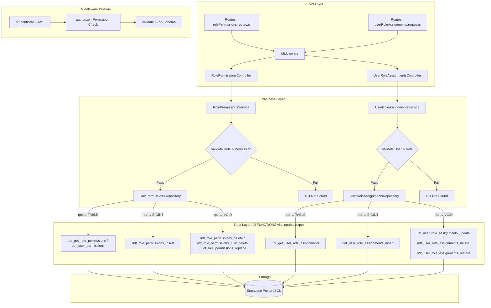

# GrowUpMore API — Role Permissions & User Role Assignments Module

## Postman Testing Guide

**Base URL:** `http://localhost:5001`
**API Prefix:** `/api/v1`
**Content-Type:** `application/json`
**Authentication:** All endpoints require `Bearer <access_token>` in Authorization header

---

## Architecture Flow



---

## Complete Endpoint Reference

### Test Order (follow this sequence in Postman)

| # | Endpoint | Method | Permission | Purpose |
|---|----------|--------|-----------|---------|
| 1 | `/role-permissions/me` | GET | auth only | Get current user's permissions |
| 2 | `/role-permissions` | GET | `permission.manage` | List all role permissions with filters |
| 3 | `/role-permissions/user/:userId` | GET | `permission.manage` | Get specific user's permissions |
| 4 | `/role-permissions/assign` | POST | `permission.manage` | Assign single permission to role |
| 5 | `/role-permissions/bulk-assign` | POST | `permission.manage` | Assign multiple permissions to role |
| 6 | `/role-permissions/remove` | POST | `permission.manage` | Remove single permission from role |
| 7 | `/role-permissions/role/:roleId` | DELETE | `permission.manage` | Remove all permissions from role |
| 8 | `/role-permissions/replace` | PUT | `permission.manage` | Replace all permissions for role |
| 9 | `/user-role-assignments` | GET | `role.assign` | List all user role assignments |
| 10 | `/user-role-assignments/:id` | GET | `role.assign` | Get single user role assignment |
| 11 | `/user-role-assignments` | POST | `role.assign` | Create user role assignment |
| 12 | `/user-role-assignments/:id` | PUT | `role.assign` | Update user role assignment |
| 13 | `/user-role-assignments/:id` | DELETE | `role.assign` | Delete user role assignment |
| 14 | `/user-role-assignments/:id/restore` | PATCH | `role.assign` | Restore deleted user role assignment |

---

## Prerequisites

Before testing, ensure:

1. **Authentication**: Login via `POST /api/v1/auth/login` to obtain `access_token`
2. **Permissions**: Run role & permission seeding scripts in Supabase SQL Editor
3. **Users & Roles**: Ensure target users and roles exist (from Phase 01 & 02)

---

## 1. ROLE-PERMISSIONS

### 1.1 Get Current User Permissions

**`GET /api/v1/role-permissions/me`**

**Headers:**
```
Authorization: Bearer {{access_token}}
Content-Type: application/json
```

**Expected Response (200):**
```json
{
  "success": true,
  "statusCode": 200,
  "message": "Your permissions fetched",
  "data": [
    {
      "permissionCode": "branch.create",
      "permissionName": "Create Branch",
      "moduleCode": "branch_management",
      "roleCode": "admin",
      "scope": "global"
    },
    {
      "permissionCode": "department.read",
      "permissionName": "Read Department",
      "moduleCode": "branch_management",
      "roleCode": "admin",
      "scope": "global"
    }
  ]
}
```

**Postman Tests:**
```javascript
pm.test("Status is 200", () => pm.response.to.have.status(200));
const json = pm.response.json();
pm.test("Data is array", () => pm.expect(json.data).to.be.an("array"));
pm.test("Has permission codes", () => {
    json.data.forEach(perm => {
        pm.expect(perm).to.have.property("permissionCode");
        pm.expect(perm).to.have.property("moduleCode");
    });
});
```

---

### 1.2 List Role Permissions

**`GET /api/v1/role-permissions`**

**Headers:**
```
Authorization: Bearer {{access_token}}
```

**Query Parameters:**

| Parameter | Type | Default | Description |
|-----------|------|---------|-------------|
| `page` | number | 1 | Page number |
| `limit` | number | 20 | Items per page (max 200) |
| `search` | string | — | Search by permission or role name |
| `sortBy` | string | id | Sort column |
| `sortDir` | string | ASC | Sort direction (ASC/DESC) |
| `roleId` | number | — | Filter by role ID |
| `roleCode` | string | — | Filter by role code |
| `permissionId` | number | — | Filter by permission ID |
| `moduleCode` | string | — | Filter by module code |
| `action` | string | — | Filter by action (create/read/update/delete) |
| `scope` | string | — | Filter by scope (global/own/assigned) |

**Example:** `GET /api/v1/role-permissions?roleCode=admin&scope=global&page=1&limit=10`

**Expected Response (200):**
```json
{
  "success": true,
  "statusCode": 200,
  "message": "Role permissions fetched",
  "data": [
    {
      "id": 1,
      "roleId": 1,
      "roleName": "Administrator",
      "roleCode": "admin",
      "permissionId": 1,
      "permissionName": "Create Branch",
      "permissionCode": "branch.create",
      "permissionResource": "branch",
      "permissionAction": "create",
      "permissionScope": "global",
      "moduleName": "Branch Management",
      "moduleCode": "branch_management",
      "isActive": true,
      "createdAt": "2026-03-15T09:30:00+05:30"
    }
  ],
  "pagination": {
    "totalCount": 1,
    "pageIndex": 1,
    "pageSize": 10
  }
}
```

**Postman Tests:**
```javascript
pm.test("Status is 200", () => pm.response.to.have.status(200));
const json = pm.response.json();
pm.test("Data is array", () => pm.expect(json.data).to.be.an("array"));
pm.test("Has pagination", () => {
    pm.expect(json.pagination).to.have.property("totalCount");
    pm.expect(json.pagination).to.have.property("pageIndex");
    pm.expect(json.pagination).to.have.property("pageSize");
});
```

---

### 1.3 Get User Permissions

**`GET /api/v1/role-permissions/user/:userId`**

**Headers:**
```
Authorization: Bearer {{access_token}}
```

**Example:** `GET /api/v1/role-permissions/user/5`

**Expected Response (200):**
```json
{
  "success": true,
  "statusCode": 200,
  "message": "User permissions fetched",
  "data": [
    {
      "permissionCode": "branch.create",
      "permissionName": "Create Branch",
      "moduleCode": "branch_management",
      "roleCode": "branch_manager",
      "scope": "assigned"
    },
    {
      "permissionCode": "department.read",
      "permissionName": "Read Department",
      "moduleCode": "branch_management",
      "roleCode": "branch_manager",
      "scope": "assigned"
    }
  ]
}
```

---

### 1.4 Assign Permission to Role

**`POST /api/v1/role-permissions/assign`**

**Headers:**
```
Authorization: Bearer {{access_token}}
Content-Type: application/json
```

**Body (JSON):**
```json
{
  "roleId": 1,
  "permissionId": 5
}
```

**Expected Response (201):**
```json
{
  "success": true,
  "statusCode": 201,
  "message": "Permission assigned to role",
  "data": {
    "id": 1
  }
}
```

**Postman Tests:**
```javascript
pm.test("Status is 201", () => pm.response.to.have.status(201));
const json = pm.response.json();
pm.test("Has assignment ID", () => pm.expect(json.data.id).to.be.a("number"));
pm.collectionVariables.set("rolePermissionId", json.data.id);
```

---

### 1.5 Bulk Assign Permissions to Role

**`POST /api/v1/role-permissions/bulk-assign`**

**Headers:**
```
Authorization: Bearer {{access_token}}
Content-Type: application/json
```

**Body (JSON):**
```json
{
  "roleId": 2,
  "permissionIds": [1, 2, 5, 8]
}
```

**Expected Response (201):**
```json
{
  "success": true,
  "statusCode": 201,
  "message": "Permissions assigned to role",
  "data": null
}
```

---

### 1.6 Remove Permission from Role

**`POST /api/v1/role-permissions/remove`**

**Headers:**
```
Authorization: Bearer {{access_token}}
Content-Type: application/json
```

**Body (JSON):**
```json
{
  "roleId": 1,
  "permissionId": 5
}
```

**Expected Response (200):**
```json
{
  "success": true,
  "statusCode": 200,
  "message": "Permission removed from role",
  "data": null
}
```

---

### 1.7 Remove All Permissions from Role

**`DELETE /api/v1/role-permissions/role/:roleId`**

**Headers:**
```
Authorization: Bearer {{access_token}}
```

**Example:** `DELETE /api/v1/role-permissions/role/2`

**Expected Response (200):**
```json
{
  "success": true,
  "statusCode": 200,
  "message": "All permissions removed from role",
  "data": null
}
```

---

### 1.8 Replace All Permissions for Role

**`PUT /api/v1/role-permissions/replace`**

**Headers:**
```
Authorization: Bearer {{access_token}}
Content-Type: application/json
```

**Body (JSON):**
```json
{
  "roleId": 1,
  "permissionIds": [1, 3, 5]
}
```

Note: Pass empty array to remove all permissions.

**Expected Response (200):**
```json
{
  "success": true,
  "statusCode": 200,
  "message": "Role permissions replaced",
  "data": null
}
```

---

## 2. USER-ROLE-ASSIGNMENTS

### 2.1 List User Role Assignments

**`GET /api/v1/user-role-assignments`**

**Headers:**
```
Authorization: Bearer {{access_token}}
```

**Query Parameters:**

| Parameter | Type | Default | Description |
|-----------|------|---------|-------------|
| `page` | number | 1 | Page number |
| `limit` | number | 20 | Items per page (max 200) |
| `search` | string | — | Search by user email or role name |
| `sortBy` | string | id | Sort column |
| `sortDir` | string | ASC | Sort direction (ASC/DESC) |
| `id` | number | — | Filter by assignment ID |
| `userId` | number | — | Filter by user ID |
| `roleId` | number | — | Filter by role ID |
| `roleCode` | string | — | Filter by role code |
| `contextType` | string | — | Filter by context (course/batch/department/branch/internship) |
| `contextId` | number | — | Filter by context ID |
| `isValid` | string | — | Filter by validity (true/false) |

**Example:** `GET /api/v1/user-role-assignments?roleCode=instructor&contextType=course&page=1&limit=10`

**Expected Response (200):**
```json
{
  "success": true,
  "statusCode": 200,
  "message": "User role assignments fetched",
  "data": [
    {
      "id": 1,
      "userId": 5,
      "userEmail": "rajesh.kumar@growupmore.com",
      "userFirstName": "Rajesh",
      "userLastName": "Kumar",
      "roleId": 2,
      "roleName": "Instructor",
      "roleCode": "instructor",
      "roleLevel": 3,
      "contextType": "course",
      "contextId": 12,
      "assignedAt": "2026-03-10T10:00:00+05:30",
      "expiresAt": "2026-12-31T23:59:59+05:30",
      "reason": "Assigned as course instructor for Web Development",
      "assignedBy": 1,
      "isActive": true,
      "isCurrentlyValid": true
    }
  ],
  "pagination": {
    "totalCount": 1,
    "pageIndex": 1,
    "pageSize": 10
  }
}
```

**Postman Tests:**
```javascript
pm.test("Status is 200", () => pm.response.to.have.status(200));
const json = pm.response.json();
pm.test("Data is array", () => pm.expect(json.data).to.be.an("array"));
pm.test("Has pagination", () => {
    pm.expect(json.pagination).to.have.property("totalCount");
});
```

---

### 2.2 Get User Role Assignment by ID

**`GET /api/v1/user-role-assignments/:id`**

**Headers:**
```
Authorization: Bearer {{access_token}}
```

**Example:** `GET /api/v1/user-role-assignments/1`

**Expected Response (200):**
```json
{
  "success": true,
  "statusCode": 200,
  "message": "User role assignment fetched",
  "data": [
    {
      "id": 1,
      "userId": 5,
      "userEmail": "rajesh.kumar@growupmore.com",
      "userFirstName": "Rajesh",
      "userLastName": "Kumar",
      "roleId": 2,
      "roleName": "Instructor",
      "roleCode": "instructor",
      "roleLevel": 3,
      "contextType": "course",
      "contextId": 12,
      "assignedAt": "2026-03-10T10:00:00+05:30",
      "expiresAt": "2026-12-31T23:59:59+05:30",
      "reason": "Assigned as course instructor for Web Development",
      "assignedBy": 1,
      "isActive": true,
      "isCurrentlyValid": true
    }
  ]
}
```

---

### 2.3 Create User Role Assignment

**`POST /api/v1/user-role-assignments`**

**Headers:**
```
Authorization: Bearer {{access_token}}
Content-Type: application/json
```

**Body (JSON):**
```json
{
  "userId": 5,
  "roleId": 2,
  "contextType": "course",
  "contextId": 12,
  "expiresAt": "2026-12-31T23:59:59+05:30",
  "reason": "Assigned as course instructor for Web Development"
}
```

Note: `contextType` and `contextId` must both be present or both omitted.

**Expected Response (201):**
```json
{
  "success": true,
  "statusCode": 201,
  "message": "User role assignment created",
  "data": {
    "id": 1
  }
}
```

**Postman Tests:**
```javascript
pm.test("Status is 201", () => pm.response.to.have.status(201));
const json = pm.response.json();
pm.test("Has assignment ID", () => pm.expect(json.data.id).to.be.a("number"));
pm.collectionVariables.set("assignmentId", json.data.id);
```

---

### 2.4 Create Organization-Wide Role Assignment (No Context)

**`POST /api/v1/user-role-assignments`**

**Headers:**
```
Authorization: Bearer {{access_token}}
Content-Type: application/json
```

**Body (JSON):**
```json
{
  "userId": 6,
  "roleId": 1,
  "expiresAt": "2027-06-30T23:59:59+05:30",
  "reason": "Promoted to Admin role for organization management"
}
```

**Expected Response (201):**
```json
{
  "success": true,
  "statusCode": 201,
  "message": "User role assignment created",
  "data": {
    "id": 2
  }
}
```

---

### 2.5 Update User Role Assignment

**`PUT /api/v1/user-role-assignments/:id`**

**Headers:**
```
Authorization: Bearer {{access_token}}
Content-Type: application/json
```

**Body (JSON — partial update supported):**
```json
{
  "expiresAt": "2026-06-30T23:59:59+05:30",
  "reason": "Extended assignment through Q2 2026",
  "isActive": true
}
```

Note: Pass `null` for `expiresAt` or `reason` to clear them.

**Expected Response (200):**
```json
{
  "success": true,
  "statusCode": 200,
  "message": "User role assignment updated",
  "data": null
}
```

---

### 2.6 Delete User Role Assignment

**`DELETE /api/v1/user-role-assignments/:id`**

**Headers:**
```
Authorization: Bearer {{access_token}}
```

**Example:** `DELETE /api/v1/user-role-assignments/1`

**Expected Response (200):**
```json
{
  "success": true,
  "statusCode": 200,
  "message": "User role assignment deleted",
  "data": null
}
```

---

### 2.7 Restore User Role Assignment

**`PATCH /api/v1/user-role-assignments/:id/restore`**

**Headers:**
```
Authorization: Bearer {{access_token}}
Content-Type: application/json
```

**Example:** `PATCH /api/v1/user-role-assignments/1/restore`

**Response (200 OK):**
```json
{
  "success": true,
  "statusCode": 200,
  "message": "User role assignment restored",
  "data": {
    "id": 1
  }
}
```

Note: Restores a soft-deleted user role assignment. No request body required.

---

## Postman Collection Variables

Set these variables in your Postman collection for easy reuse:

| Variable | Initial Value | Description |
|----------|---------------|-------------|
| `baseUrl` | `http://localhost:5001` | API base URL |
| `access_token` | *(from login)* | JWT access token |
| `rolePermissionId` | *(auto-set)* | Last created role-permission ID |
| `assignmentId` | *(auto-set)* | Last created user-role-assignment ID |
| `userId` | 5 | Test user ID (Rajesh Kumar) |
| `roleId` | 2 | Test role ID (Instructor) |
| `contextType` | course | Test context type |
| `contextId` | 12 | Test context ID |

---

## Error Responses

All endpoints follow a consistent error format:

**Validation Error (400):**
```json
{
  "success": false,
  "statusCode": 400,
  "message": "Validation error",
  "errors": [
    {
      "field": "roleId",
      "message": "Expected number, received null"
    },
    {
      "field": "permissionIds",
      "message": "Array must contain at least 1 element(s)"
    }
  ]
}
```

**Unauthorized (401):**
```json
{
  "success": false,
  "statusCode": 401,
  "message": "Access token is missing or invalid"
}
```

**Forbidden (403):**
```json
{
  "success": false,
  "statusCode": 403,
  "message": "You do not have permission to perform this action"
}
```

**Not Found (404):**
```json
{
  "success": false,
  "statusCode": 404,
  "message": "Role not found"
}
```

**Duplicate/Conflict (409):**
```json
{
  "success": false,
  "statusCode": 409,
  "message": "This permission is already assigned to this role"
}
```

---

## Permission Codes Summary

### Role Permissions Module

| Permission Code | Resource | Action | Scope | Module |
|-----------------|----------|--------|-------|--------|
| `permission.manage` | Permission | Manage | global | role_management |

### User Role Assignments Module

| Permission Code | Resource | Action | Scope | Module |
|-----------------|----------|--------|-------|--------|
| `role.assign` | Role | Assign | global | role_management |

**Module:** `role_management` (module_id = 4)

---

## Database Functions Reference

### Role Permissions Functions

| Function | Type | Description |
|----------|------|-------------|
| `udf_get_role_permissions` | SELECT | Get all role permissions with filters |
| `udf_user_permissions` | SELECT | Get current user's permissions |
| `udf_role_permissions_insert` | INSERT | Assign permission to role |
| `udf_role_permissions_delete` | DELETE | Remove single permission from role |
| `udf_role_permissions_bulk_delete` | DELETE | Remove all permissions from role |
| `udf_role_permissions_replace` | UPSERT | Replace all permissions for role |

### User Role Assignments Functions

| Function | Type | Description |
|----------|------|-------------|
| `udf_get_user_role_assignments` | SELECT | Get user role assignments with filters |
| `udf_user_role_assignments_insert` | INSERT | Create user role assignment |
| `udf_user_role_assignments_update` | UPDATE | Update user role assignment |
| `udf_user_role_assignments_delete` | DELETE | Soft-delete user role assignment |
| `udf_user_role_assignments_restore` | UPDATE | Restore soft-deleted assignment |

---

## Complete Data Models

### RolePermissionResponse Model

```json
{
  "id": "number — primary key",
  "roleId": "number — FK to roles table",
  "roleName": "string — role display name",
  "roleCode": "string — role unique code",
  "permissionId": "number — FK to permissions table",
  "permissionName": "string — permission display name",
  "permissionCode": "string — permission unique code",
  "permissionResource": "string — resource (e.g., branch, department)",
  "permissionAction": "string — action (create, read, update, delete)",
  "permissionScope": "enum — global | own | assigned",
  "moduleName": "string — module display name",
  "moduleCode": "string — module unique code",
  "isActive": "boolean — is assignment active",
  "createdAt": "ISO datetime — assignment creation time"
}
```

### UserPermissionResponse Model

```json
{
  "permissionCode": "string — permission unique code",
  "permissionName": "string — permission display name",
  "moduleCode": "string — module unique code",
  "roleCode": "string — role unique code",
  "scope": "enum — global | own | assigned"
}
```

### UserRoleAssignmentResponse Model

```json
{
  "id": "number — primary key",
  "userId": "number — FK to users table",
  "userEmail": "string — user email address",
  "userFirstName": "string — user first name",
  "userLastName": "string — user last name",
  "roleId": "number — FK to roles table",
  "roleName": "string — role display name",
  "roleCode": "string — role unique code",
  "roleLevel": "number — role hierarchy level",
  "contextType": "enum — course | batch | department | branch | internship | null",
  "contextId": "number — context entity ID | null",
  "assignedAt": "ISO datetime — assignment creation time",
  "expiresAt": "ISO datetime | null — assignment expiration time",
  "reason": "string | null — assignment reason (1-500 chars)",
  "assignedBy": "number — FK to users table (assigner)",
  "isActive": "boolean — is assignment currently active",
  "isCurrentlyValid": "boolean — is assignment currently valid based on expiry"
}
```

---

## Sample Test Data (Indian Context)

### Sample Role Permission Assignment

**Request Body:**
```json
{
  "roleId": 1,
  "permissionId": 5
}
```

### Sample Bulk Permission Assignment

**Request Body:**
```json
{
  "roleId": 2,
  "permissionIds": [1, 2, 3, 5]
}
```

### Sample User Role Assignment (Course Context)

**Request Body:**
```json
{
  "userId": 5,
  "roleId": 2,
  "contextType": "course",
  "contextId": 12,
  "expiresAt": "2026-12-31T23:59:59+05:30",
  "reason": "Assigned as course instructor for Web Development Bootcamp"
}
```

### Sample User Role Assignment (Department Context)

**Request Body:**
```json
{
  "userId": 8,
  "roleId": 3,
  "contextType": "department",
  "contextId": 2,
  "expiresAt": "2027-03-31T23:59:59+05:30",
  "reason": "Department Head for Engineering"
}
```

### Sample Organization-Wide Role Assignment

**Request Body:**
```json
{
  "userId": 6,
  "roleId": 1,
  "expiresAt": "2027-06-30T23:59:59+05:30",
  "reason": "Promoted to Admin for organization-wide management"
}
```

### Sample User Update

**Request Body:**
```json
{
  "expiresAt": "2026-06-30T23:59:59+05:30",
  "reason": "Extended assignment through Q2 2026 based on performance review",
  "isActive": true
}
```

---

## Common Testing Scenarios

### Scenario 1: Assign Admin Role with All Permissions

1. Get role ID for admin: `GET /role-permissions?roleCode=admin`
2. Get all available permissions: `GET /role-permissions?roleCode=admin`
3. Bulk assign: `POST /role-permissions/bulk-assign`

### Scenario 2: Create Course Instructor Assignment

1. Create assignment: `POST /user-role-assignments`
   - userId: 5, roleId: 2, contextType: course, contextId: 12
2. Verify in list: `GET /user-role-assignments?userId=5&roleCode=instructor`
3. Update expiry: `PUT /user-role-assignments/1`
   - expiresAt: extended date

### Scenario 3: Revoke and Restore Access

1. Delete assignment: `DELETE /user-role-assignments/1`
2. Verify soft-delete: `GET /user-role-assignments/1` (should return 404 or isActive=false)
3. Restore: `PATCH /user-role-assignments/1/restore`
4. Verify restored: `GET /user-role-assignments/1` (should be active again)

### Scenario 4: Replace All Role Permissions

1. Get current permissions: `GET /role-permissions?roleId=2`
2. Prepare new permission list
3. Replace: `PUT /role-permissions/replace`
   - roleId: 2, permissionIds: [1, 3, 5]
4. Verify: `GET /role-permissions?roleId=2`

---

## Validation Rules

### Role-Permissions Validation

- **roleId**: Required, must be positive integer, role must exist
- **permissionId**: Required, must be positive integer, permission must exist
- **permissionIds** (bulk): Required, array of positive integers, min length 1, max length 100
- **Duplicate Check**: Cannot assign same permission to role twice (409 error)

### User-Role-Assignments Validation

- **userId**: Required, must be positive integer, user must exist
- **roleId**: Required, must be positive integer, role must exist
- **contextType**: Optional, must be one of: course, batch, department, branch, internship
- **contextId**: Optional, must be positive integer if provided
- **Validation Rule**: contextType and contextId must both be present or both omitted
- **expiresAt**: Optional, must be ISO datetime with timezone offset, must be future date if provided
- **reason**: Optional, string 1-500 characters if provided
- **isActive**: Optional in updates, boolean value

---

## Error Handling Guide

| Scenario | Error Code | Message | Resolution |
|----------|-----------|---------|------------|
| Missing token | 401 | Access token is missing or invalid | Add Authorization header with valid JWT |
| Insufficient permission | 403 | You do not have permission to perform this action | User needs `permission.manage` or `role.assign` role |
| Role not found | 404 | Role not found | Verify roleId exists in system |
| Permission not found | 404 | Permission not found | Verify permissionId exists in system |
| User not found | 404 | User not found | Verify userId exists in system |
| Duplicate assignment | 409 | This permission is already assigned to this role | Remove existing assignment first |
| Invalid context | 400 | contextType and contextId must both be present or both omitted | Fix context parameters |
| Invalid expiry date | 400 | expiresAt must be in the future | Use a future date for expiration |
| Reason too long | 400 | Reason must be between 1 and 500 characters | Keep reason under 500 characters |

---

## Integration Notes

- All timestamps use ISO 8601 format with timezone offset (e.g., +05:30 for IST)
- Soft delete is used for user-role-assignments; deleted records can be restored
- Role-permission assignments do not support soft delete (permanent removal)
- Assignment validity is calculated based on isActive flag and expiresAt timestamp
- User permissions are derived from their assigned roles
- Context-based assignments allow fine-grained access control per course/batch/department
