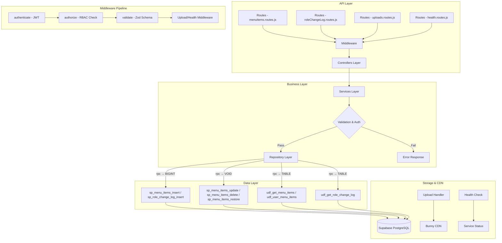

# GrowUpMore API — Menu Items, Role Change Log, Uploads, Health Modules

## Postman Testing Guide

**Base URL:** `http://localhost:5001`
**API Prefix:** `/api/v1`
**Content-Type:** `application/json` (or `multipart/form-data` for uploads)
**Authentication:** Most endpoints require `Bearer <access_token>` in Authorization header (Health is public)

---

## Architecture Flow



---

## Complete Endpoint Reference

### Test Order (follow this sequence in Postman)

| # | Module | Endpoint | Permission | Purpose |
|---|--------|----------|-----------|---------|
| 1 | Menu Items | `GET /menu-items/me` | auth only | Get current user's menu |
| 2 | Menu Items | `POST /menu-items` | `menu.create` | Create root menu item |
| 3 | Menu Items | `GET /menu-items` | `menu.read` | List all menu items |
| 4 | Menu Items | `GET /menu-items/:id` | `menu.read` | Get menu item by ID |
| 5 | Menu Items | `PUT /menu-items/:id` | `menu.update` | Update menu item |
| 6 | Menu Items | `DELETE /menu-items/:id` | `menu.delete` | Soft-delete menu item |
| 7 | Menu Items | `PATCH /menu-items/:id/restore` | `menu.restore` | Restore deleted menu item |
| 8 | Uploads | `POST /uploads/image` | auth only | Upload image file |
| 9 | Uploads | `POST /uploads/document` | auth only | Upload document file |
| 10 | Role Change Log | `POST /role-change-log` | `admin_log.create` | Create audit log entry |
| 11 | Role Change Log | `GET /role-change-log` | `admin_log.read` | List audit log entries |
| 12 | Role Change Log | `GET /role-change-log/:id` | `admin_log.read` | Get audit log by ID |
| 13 | Health | `GET /health` | public | Check system health |

---

## Prerequisites

Before testing, ensure:

1. **Authentication**: Login via `POST /api/v1/auth/login` to obtain `access_token`
2. **Permissions**: Run permission seed scripts in Supabase SQL Editor
3. **File Uploads**: Ensure Bunny CDN is configured and `MAX_FILE_SIZE_MB` env var is set

---

## 1. MENU ITEMS

### 1.1 Get User Menu (Current User)

**`GET /api/v1/menu-items/me`**

**Headers:**
```
Authorization: Bearer {{access_token}}
```

**No Query Parameters Required**

**Expected Response (200):**
```json
{
  "success": true,
  "statusCode": 200,
  "message": "User menu fetched",
  "data": [
    {
      "id": 1,
      "name": "Dashboard",
      "code": "dashboard",
      "route": "/dashboard",
      "icon": "home",
      "parentId": null,
      "displayOrder": 1
    },
    {
      "id": 2,
      "name": "Settings",
      "code": "settings",
      "route": "/settings",
      "icon": "cog",
      "parentId": null,
      "displayOrder": 2
    }
  ]
}
```

**Postman Tests:**
```javascript
pm.test("Status is 200", () => pm.response.to.have.status(200));
const json = pm.response.json();
pm.test("Data is array", () => pm.expect(json.data).to.be.an("array"));
pm.test("Contains user menu items", () => pm.expect(json.data.length).to.be.greaterThan(0));
pm.collectionVariables.set("menuItemId", json.data[0].id);
```

---

### 1.2 Create Menu Item

**`POST /api/v1/menu-items`**

**Headers:**
```
Authorization: Bearer {{access_token}}
Content-Type: application/json
```

**Body (JSON):**
```json
{
  "name": "Dashboard",
  "code": "dashboard",
  "route": "/admin/dashboard",
  "icon": "home",
  "description": "Main dashboard for administrators",
  "parentMenuId": null,
  "permissionId": 1,
  "displayOrder": 1,
  "isVisible": true,
  "isActive": true
}
```

**Expected Response (201):**
```json
{
  "success": true,
  "statusCode": 201,
  "message": "Menu item created",
  "data": {
    "id": 5
  }
}
```

**Postman Tests:**
```javascript
pm.test("Status is 201", () => pm.response.to.have.status(201));
const json = pm.response.json();
pm.test("Has menu item ID", () => pm.expect(json.data.id).to.be.a("number"));
pm.collectionVariables.set("createdMenuItemId", json.data.id);
```

---

### 1.3 Create Sub-Menu Item

**`POST /api/v1/menu-items`**

**Body (JSON — child of Dashboard):**
```json
{
  "name": "User Management",
  "code": "user_management",
  "route": "/admin/users",
  "icon": "users",
  "description": "Manage system users and roles",
  "parentMenuId": 5,
  "permissionId": 2,
  "displayOrder": 1,
  "isVisible": true,
  "isActive": true
}
```

---

### 1.4 List Menu Items

**`GET /api/v1/menu-items`**

**Headers:**
```
Authorization: Bearer {{access_token}}
```

**Query Parameters:**

| Parameter | Type | Default | Description |
|-----------|------|---------|-------------|
| `page` | number | 1 | Page number |
| `limit` | number | 50 | Items per page (max 200) |
| `id` | number | — | Filter by ID |
| `code` | string | — | Filter by code |
| `parentId` | number | — | Filter by parent menu ID |
| `topLevelOnly` | boolean/string | — | Show only root items (true/false) |
| `isActive` | boolean/string | — | Filter by active status (true/false) |
| `sortBy` | string | display_order | Sort by: display_order, name, code, created_at |
| `sortDir` | string | ASC | Sort direction: ASC or DESC |

**Example:** `GET /api/v1/menu-items?topLevelOnly=true&isActive=true&sortBy=display_order`

**Expected Response (200):**
```json
{
  "success": true,
  "statusCode": 200,
  "message": "Menu items fetched",
  "data": [
    {
      "id": 5,
      "name": "Dashboard",
      "code": "dashboard",
      "description": "Main dashboard for administrators",
      "route": "/admin/dashboard",
      "icon": "home",
      "parentId": null,
      "parentName": null,
      "permissionId": 1,
      "permissionCode": "admin.read",
      "displayOrder": 1,
      "isVisible": true,
      "isActive": true
    },
    {
      "id": 6,
      "name": "Settings",
      "code": "settings",
      "description": "System settings and configuration",
      "route": "/admin/settings",
      "icon": "cog",
      "parentId": null,
      "parentName": null,
      "permissionId": null,
      "permissionCode": null,
      "displayOrder": 2,
      "isVisible": true,
      "isActive": true
    }
  ],
  "pagination": {
    "totalCount": 2,
    "pageIndex": 1,
    "pageSize": 50
  }
}
```

**Postman Tests:**
```javascript
pm.test("Status is 200", () => pm.response.to.have.status(200));
const json = pm.response.json();
pm.test("Data is array", () => pm.expect(json.data).to.be.an("array"));
pm.test("Has pagination", () => {
    pm.expect(json.pagination).to.have.property("totalCount");
    pm.expect(json.pagination).to.have.property("pageIndex");
});
```

---

### 1.5 Get Menu Item by ID

**`GET /api/v1/menu-items/:id`**

**Headers:**
```
Authorization: Bearer {{access_token}}
```

**Example:** `GET /api/v1/menu-items/{{menuItemId}}`

**Expected Response (200):**
```json
{
  "success": true,
  "statusCode": 200,
  "message": "Menu item fetched",
  "data": {
    "id": 5,
    "name": "Dashboard",
    "code": "dashboard",
    "description": "Main dashboard for administrators",
    "route": "/admin/dashboard",
    "icon": "home",
    "parentId": null,
    "parentName": null,
    "permissionId": 1,
    "permissionCode": "admin.read",
    "displayOrder": 1,
    "isVisible": true,
    "isActive": true
  }
}
```

---

### 1.6 Update Menu Item

**`PUT /api/v1/menu-items/:id`**

**Headers:**
```
Authorization: Bearer {{access_token}}
Content-Type: application/json
```

**Body (JSON — partial update supported):**
```json
{
  "name": "Admin Dashboard",
  "description": "Updated admin dashboard",
  "displayOrder": 2,
  "isActive": true
}
```

**Expected Response (200):**
```json
{
  "success": true,
  "statusCode": 200,
  "message": "Menu item updated",
  "data": null
}
```

**Postman Tests:**
```javascript
pm.test("Status is 200", () => pm.response.to.have.status(200));
pm.test("Success is true", () => {
    const json = pm.response.json();
    pm.expect(json.success).to.be.true;
});
```

---

### 1.7 Delete Menu Item

**`DELETE /api/v1/menu-items/:id`**

**Headers:**
```
Authorization: Bearer {{access_token}}
```

**Expected Response (200):**
```json
{
  "success": true,
  "statusCode": 200,
  "message": "Menu item deleted"
}
```

> **Note:** Cascades to child menu items (soft delete)

---

### 1.8 Restore Menu Item

**`PATCH /api/v1/menu-items/:id/restore`**

**Headers:**
```
Authorization: Bearer {{access_token}}
Content-Type: application/json
```

**Body (JSON):**
```json
{
  "restoreChildren": true
}
```

**Expected Response (200):**
```json
{
  "success": true,
  "statusCode": 200,
  "message": "Menu item restored",
  "data": {
    "id": 5
  }
}
```

> **Note:** `restoreChildren` is optional (defaults to false)

---

## 2. ROLE CHANGE LOG (Append-Only Audit Log)

### 2.1 Create Role Change Log Entry

**`POST /api/v1/role-change-log`**

**Headers:**
```
Authorization: Bearer {{access_token}}
Content-Type: application/json
```

**Body (JSON):**
```json
{
  "userId": 42,
  "action": "assigned",
  "roleId": 3,
  "contextType": "department",
  "contextId": 15,
  "oldValues": null,
  "newValues": {
    "role_name": "Department Head",
    "department_name": "Engineering"
  },
  "reason": "Promoted to head of Engineering department",
  "ipAddress": "192.168.1.100"
}
```

**Expected Response (201):**
```json
{
  "success": true,
  "statusCode": 201,
  "message": "Role change log entry created",
  "data": {
    "id": 256
  }
}
```

**Postman Tests:**
```javascript
pm.test("Status is 201", () => pm.response.to.have.status(201));
const json = pm.response.json();
pm.test("Has log entry ID", () => pm.expect(json.data.id).to.be.a("number"));
pm.collectionVariables.set("logEntryId", json.data.id);
```

---

### 2.2 List Role Change Log Entries

**`GET /api/v1/role-change-log`**

**Headers:**
```
Authorization: Bearer {{access_token}}
```

**Query Parameters:**

| Parameter | Type | Default | Description |
|-----------|------|---------|-------------|
| `page` | number | 1 | Page number |
| `limit` | number | 50 | Items per page (max 200) |
| `id` | number | — | Filter by log entry ID |
| `userId` | number | — | Filter by user ID |
| `roleId` | number | — | Filter by role ID |
| `action` | string | — | Filter by action: assigned, revoked, expired, modified, restored |
| `contextType` | string | — | Filter by context: course, batch, department, branch, internship |
| `changedBy` | number | — | Filter by user who made change |
| `dateFrom` | string (ISO) | — | Filter from date (e.g., 2026-04-01T00:00:00+05:30) |
| `dateTo` | string (ISO) | — | Filter to date (e.g., 2026-04-08T23:59:59+05:30) |
| `search` | string | — | Search by user email or role name |
| `sortBy` | string | created_at | Sort by: created_at, action, role_name, user_email |
| `sortDir` | string | DESC | Sort direction: ASC or DESC |

**Example:** `GET /api/v1/role-change-log?action=assigned&dateFrom=2026-04-01T00:00:00%2B05:30&sortDir=DESC`

**Expected Response (200):**
```json
{
  "success": true,
  "statusCode": 200,
  "message": "Role change logs fetched",
  "data": [
    {
      "id": 256,
      "userId": 42,
      "userEmail": "rajesh.kumar@growupmore.com",
      "userFirstName": "Rajesh",
      "userLastName": "Kumar",
      "action": "assigned",
      "roleId": 3,
      "roleCode": "dept_head",
      "roleName": "Department Head",
      "contextType": "department",
      "contextId": 15,
      "reason": "Promoted to head of Engineering department",
      "changedBy": 1,
      "changedByEmail": "admin@growupmore.com",
      "createdAt": "2026-04-08T14:30:00+05:30"
    },
    {
      "id": 255,
      "userId": 41,
      "userEmail": "priya.sharma@growupmore.com",
      "userFirstName": "Priya",
      "userLastName": "Sharma",
      "action": "revoked",
      "roleId": 2,
      "roleCode": "instructor",
      "roleName": "Instructor",
      "contextType": "course",
      "contextId": 8,
      "reason": "Course completed, role revoked",
      "changedBy": 1,
      "changedByEmail": "admin@growupmore.com",
      "createdAt": "2026-04-07T10:15:00+05:30"
    }
  ],
  "pagination": {
    "totalCount": 2,
    "pageIndex": 1,
    "pageSize": 50
  }
}
```

**Postman Tests:**
```javascript
pm.test("Status is 200", () => pm.response.to.have.status(200));
const json = pm.response.json();
pm.test("Data is array", () => pm.expect(json.data).to.be.an("array"));
pm.test("Has pagination", () => {
    pm.expect(json.pagination).to.have.property("totalCount");
});
```

---

### 2.3 Get Role Change Log Entry by ID

**`GET /api/v1/role-change-log/:id`**

**Headers:**
```
Authorization: Bearer {{access_token}}
```

**Example:** `GET /api/v1/role-change-log/{{logEntryId}}`

**Expected Response (200):**
```json
{
  "success": true,
  "statusCode": 200,
  "message": "Role change log entry fetched",
  "data": {
    "id": 256,
    "userId": 42,
    "userEmail": "rajesh.kumar@growupmore.com",
    "userFirstName": "Rajesh",
    "userLastName": "Kumar",
    "action": "assigned",
    "roleId": 3,
    "roleCode": "dept_head",
    "roleName": "Department Head",
    "contextType": "department",
    "contextId": 15,
    "reason": "Promoted to head of Engineering department",
    "changedBy": 1,
    "changedByEmail": "admin@growupmore.com",
    "createdAt": "2026-04-08T14:30:00+05:30"
  }
}
```

---

### 2.4 Role Change Log Additional Examples

**Example 1: Role Modified**
```json
{
  "userId": 43,
  "action": "modified",
  "roleId": 5,
  "contextType": "batch",
  "contextId": 20,
  "oldValues": {
    "permissions": ["read", "create"]
  },
  "newValues": {
    "permissions": ["read", "create", "delete"]
  },
  "reason": "Added delete permission for batch management",
  "ipAddress": "192.168.1.105"
}
```

**Example 2: Role Expired**
```json
{
  "userId": 44,
  "action": "expired",
  "roleId": 2,
  "contextType": "course",
  "contextId": 12,
  "oldValues": null,
  "newValues": null,
  "reason": "Internship contract ended",
  "ipAddress": "192.168.1.110"
}
```

> **Important Note:** Role Change Log is **append-only**. No UPDATE, DELETE, or RESTORE operations are available. All entries are immutable for audit compliance.

---

## 3. UPLOADS

### 3.1 Upload Image

**`POST /api/v1/uploads/image`**

**Headers:**
```
Authorization: Bearer {{access_token}}
Content-Type: multipart/form-data
```

**Form Data:**
| Field | Type | Required | Description |
|-------|------|----------|-------------|
| `file` | file | Yes | Image file (jpg, jpeg, png, gif, webp, svg) |

**Supported MIME Types:**
- image/jpeg
- image/png
- image/gif
- image/webp
- image/svg+xml

**Max File Size:** Configurable via `MAX_FILE_SIZE_MB` env var (default: 10MB)

**Example Postman Setup:**
1. Select `POST` method
2. Enter URL: `http://localhost:5001/api/v1/uploads/image`
3. Go to **Body** tab
4. Select **form-data**
5. Set key `file` with type **File**
6. Upload image file

**Expected Response (201):**
```json
{
  "success": true,
  "statusCode": 201,
  "message": "Image uploaded successfully",
  "data": {
    "fileName": "profile_avatar_2026_04_08_1412.jpg",
    "originalName": "profile_avatar.jpg",
    "size": 245678,
    "mimeType": "image/jpeg",
    "url": "https://cdn.bunny.net/gum/uploads/images/profile_avatar_2026_04_08_1412.jpg"
  }
}
```

**Postman Tests:**
```javascript
pm.test("Status is 201", () => pm.response.to.have.status(201));
const json = pm.response.json();
pm.test("Has image URL", () => pm.expect(json.data.url).to.include("https"));
pm.test("Has correct mime type", () => pm.expect(json.data.mimeType).to.match(/^image\//));
pm.collectionVariables.set("imageUrl", json.data.url);
```

---

### 3.2 Upload Document

**`POST /api/v1/uploads/document`**

**Headers:**
```
Authorization: Bearer {{access_token}}
Content-Type: multipart/form-data
```

**Form Data:**
| Field | Type | Required | Description |
|-------|------|----------|-------------|
| `file` | file | Yes | Document file (pdf, doc, docx, xls, xlsx, ppt, pptx, txt, csv) |

**Supported MIME Types:**
- application/pdf
- application/msword
- application/vnd.openxmlformats-officedocument.wordprocessingml.document
- application/vnd.ms-excel
- application/vnd.openxmlformats-officedocument.spreadsheetml.sheet
- application/vnd.ms-powerpoint
- application/vnd.openxmlformats-officedocument.presentationml.presentation
- text/plain
- text/csv

**Max File Size:** Configurable via `MAX_FILE_SIZE_MB` env var (default: 50MB)

**Example Postman Setup:**
1. Select `POST` method
2. Enter URL: `http://localhost:5001/api/v1/uploads/document`
3. Go to **Body** tab
4. Select **form-data**
5. Set key `file` with type **File**
6. Upload document file

**Expected Response (201):**
```json
{
  "success": true,
  "statusCode": 201,
  "message": "Document uploaded successfully",
  "data": {
    "fileName": "course_syllabus_2026_04_08_1415.pdf",
    "originalName": "course_syllabus.pdf",
    "size": 1245678,
    "mimeType": "application/pdf",
    "url": "https://cdn.bunny.net/gum/uploads/documents/course_syllabus_2026_04_08_1415.pdf"
  }
}
```

**Postman Tests:**
```javascript
pm.test("Status is 201", () => pm.response.to.have.status(201));
const json = pm.response.json();
pm.test("Has document URL", () => pm.expect(json.data.url).to.include("https"));
pm.test("Document has size", () => pm.expect(json.data.size).to.be.greaterThan(0));
pm.collectionVariables.set("documentUrl", json.data.url);
```

---

## 4. HEALTH CHECK

### 4.1 Get System Health Status

**`GET /api/v1/health`**

**Headers:**
```
(No authentication required — public endpoint)
```

**Expected Response (200):**
```json
{
  "success": true,
  "statusCode": 200,
  "message": "Healthy",
  "data": {
    "status": "healthy",
    "timestamp": "2026-04-08T14:45:30.123Z",
    "services": {
      "database": {
        "status": "up",
        "responseTime": "12ms"
      },
      "redis": {
        "status": "up",
        "responseTime": "5ms"
      },
      "bunnycdn": {
        "status": "up",
        "responseTime": "45ms"
      },
      "auth": {
        "status": "up",
        "responseTime": "8ms"
      }
    },
    "uptime": 432000,
    "version": "1.0.0"
  }
}
```

**Postman Tests:**
```javascript
pm.test("Status is 200", () => pm.response.to.have.status(200));
const json = pm.response.json();
pm.test("System is healthy", () => pm.expect(json.data.status).to.equal("healthy"));
pm.test("All services operational", () => {
    pm.expect(json.data.services.database.status).to.equal("up");
    pm.expect(json.data.services.redis.status).to.equal("up");
});
```

---

## Postman Collection Variables

Set these variables in your Postman collection for easy reuse:

| Variable | Initial Value | Description |
|----------|---------------|-------------|
| `baseUrl` | `http://localhost:5001` | API base URL |
| `access_token` | *(from login)* | JWT access token |
| `menuItemId` | *(auto-set)* | Last fetched menu item ID |
| `createdMenuItemId` | *(auto-set)* | Last created menu item ID |
| `logEntryId` | *(auto-set)* | Last created log entry ID |
| `imageUrl` | *(auto-set)* | Last uploaded image URL |
| `documentUrl` | *(auto-set)* | Last uploaded document URL |

---

## Error Responses

All endpoints follow a consistent error format:

**Validation Error (400):**
```json
{
  "success": false,
  "statusCode": 400,
  "message": "Validation error",
  "errors": [
    {
      "field": "name",
      "message": "String must contain at least 1 and at most 100 character(s)"
    },
    {
      "field": "code",
      "message": "Code must match pattern ^[a-z0-9_]+$"
    }
  ]
}
```

**Unauthorized (401):**
```json
{
  "success": false,
  "statusCode": 401,
  "message": "Access token is missing or invalid"
}
```

**Forbidden (403):**
```json
{
  "success": false,
  "statusCode": 403,
  "message": "You do not have permission to perform this action"
}
```

**Not Found (404) — Menu Item:**
```json
{
  "success": false,
  "statusCode": 404,
  "message": "Menu item not found"
}
```

**Not Found (404) — Log Entry:**
```json
{
  "success": false,
  "statusCode": 404,
  "message": "Role change log entry not found"
}
```

**File Too Large (413):**
```json
{
  "success": false,
  "statusCode": 413,
  "message": "File size exceeds maximum allowed size of 10MB"
}
```

**Unsupported File Type (415):**
```json
{
  "success": false,
  "statusCode": 415,
  "message": "Unsupported file type. Allowed types: jpg, jpeg, png, gif, webp, svg"
}
```

---

## Permission Codes Summary

| Module | Resource | Create | Read | Update | Delete | Restore |
|--------|----------|--------|------|--------|--------|---------|
| Menu Items | Menu | `menu.create` | `menu.read` | `menu.update` | `menu.delete` | `menu.restore` |
| Role Change Log | Audit Log | `admin_log.create` | `admin_log.read` | — | — | — |

**Modules:**
- `menu_management` (menu_id = 4)
- `admin_audit` (audit_id = 5)

---

## Database Functions Reference

### Menu Items

| Entity | Get | Insert | Update | Delete | Restore |
|--------|-----|--------|--------|--------|---------|
| Menu Items | `udf_get_menu_items` | `sp_menu_items_insert` | `sp_menu_items_update` | `sp_menu_items_delete` | `sp_menu_items_restore` |
| User Menu | `udf_user_menu_items` | — | — | — | — |

**Function Signatures:**
```sql
-- Get all menu items (with filters/pagination)
udf_get_menu_items(
  p_limit INT,
  p_offset INT,
  p_id INT DEFAULT NULL,
  p_code VARCHAR DEFAULT NULL,
  p_parent_id INT DEFAULT NULL,
  p_top_level_only BOOLEAN DEFAULT NULL,
  p_is_active BOOLEAN DEFAULT NULL,
  p_sort_by VARCHAR DEFAULT 'display_order',
  p_sort_dir VARCHAR DEFAULT 'ASC'
) → TABLE

-- Get menu items for current user
udf_user_menu_items() → TABLE

-- Create menu item (returns menu_id)
sp_menu_items_insert(
  p_name VARCHAR,
  p_code VARCHAR,
  p_route VARCHAR DEFAULT NULL,
  p_icon VARCHAR DEFAULT NULL,
  p_description VARCHAR DEFAULT NULL,
  p_parent_id INT DEFAULT NULL,
  p_permission_id INT DEFAULT NULL,
  p_display_order INT DEFAULT 0,
  p_is_visible BOOLEAN DEFAULT true,
  p_is_active BOOLEAN DEFAULT true
) → BIGINT

-- Update menu item
sp_menu_items_update(
  p_id INT,
  p_name VARCHAR DEFAULT NULL,
  p_code VARCHAR DEFAULT NULL,
  p_route VARCHAR DEFAULT NULL,
  p_icon VARCHAR DEFAULT NULL,
  p_description VARCHAR DEFAULT NULL,
  p_parent_id INT DEFAULT NULL,
  p_permission_id INT DEFAULT NULL,
  p_display_order INT DEFAULT NULL,
  p_is_visible BOOLEAN DEFAULT NULL,
  p_is_active BOOLEAN DEFAULT NULL
) → VOID

-- Soft-delete menu item (cascades to children)
sp_menu_items_delete(p_id INT) → VOID

-- Restore menu item
sp_menu_items_restore(
  p_id INT,
  p_restore_children BOOLEAN DEFAULT false
) → VOID
```

### Role Change Log

| Entity | Get | Insert |
|--------|-----|--------|
| Role Change Log | `udf_get_role_change_log` | `sp_role_change_log_insert` |

**Function Signatures:**
```sql
-- Get role change log (with filters/pagination, append-only)
udf_get_role_change_log(
  p_limit INT,
  p_offset INT,
  p_id INT DEFAULT NULL,
  p_user_id INT DEFAULT NULL,
  p_role_id INT DEFAULT NULL,
  p_action VARCHAR DEFAULT NULL,
  p_context_type VARCHAR DEFAULT NULL,
  p_changed_by INT DEFAULT NULL,
  p_date_from TIMESTAMPTZ DEFAULT NULL,
  p_date_to TIMESTAMPTZ DEFAULT NULL,
  p_search VARCHAR DEFAULT NULL,
  p_sort_by VARCHAR DEFAULT 'created_at',
  p_sort_dir VARCHAR DEFAULT 'DESC'
) → TABLE

-- Create role change log entry (returns log_id)
sp_role_change_log_insert(
  p_user_id INT,
  p_action VARCHAR,
  p_role_id INT DEFAULT NULL,
  p_context_type VARCHAR DEFAULT NULL,
  p_context_id INT DEFAULT NULL,
  p_old_values JSONB DEFAULT NULL,
  p_new_values JSONB DEFAULT NULL,
  p_reason VARCHAR DEFAULT NULL,
  p_ip_address VARCHAR DEFAULT NULL
) → BIGINT
```

---

## Complete Request/Response Examples

### Menu Items Complete Workflow

**Step 1: Create Root Menu**
```json
POST /api/v1/menu-items
{
  "name": "Administration",
  "code": "admin",
  "route": "/admin",
  "icon": "shield",
  "description": "Admin panel and tools",
  "displayOrder": 10,
  "isActive": true
}
```

**Step 2: Create Sub-Menu**
```json
POST /api/v1/menu-items
{
  "name": "User Management",
  "code": "user_mgmt",
  "route": "/admin/users",
  "icon": "users",
  "parentMenuId": <PARENT_ID>,
  "displayOrder": 1,
  "isActive": true
}
```

**Step 3: List with Filters**
```
GET /api/v1/menu-items?parentId=<PARENT_ID>&isActive=true&sortBy=display_order
```

### Role Change Log Complete Workflow

**Step 1: Assign Role to User**
```json
POST /api/v1/role-change-log
{
  "userId": 100,
  "action": "assigned",
  "roleId": 5,
  "contextType": "department",
  "contextId": 25,
  "newValues": {
    "department_head": true,
    "effective_date": "2026-04-08"
  },
  "reason": "New department head appointment",
  "ipAddress": "192.168.1.100"
}
```

**Step 2: Query Audit Log**
```
GET /api/v1/role-change-log?action=assigned&userId=100&sortDir=DESC
```

### Upload Files Complete Workflow

**Step 1: Upload User Avatar (Image)**
```
POST /api/v1/uploads/image
Body: form-data with file: <USER_AVATAR.JPG>
```

**Step 2: Upload Course Material (Document)**
```
POST /api/v1/uploads/document
Body: form-data with file: <COURSE_SYLLABUS.PDF>
```

**Step 3: Use URLs in Data**
```json
{
  "user_avatar_url": "<IMAGE_URL>",
  "course_material_url": "<DOCUMENT_URL>"
}
```

---

## Testing Checklist

- [ ] Environment variables configured (`MAX_FILE_SIZE_MB`, Bunny CDN credentials)
- [ ] JWT token obtained via `/auth/login`
- [ ] Health endpoint returns `healthy` status
- [ ] All menu CRUD operations working
- [ ] Menu hierarchy (parent-child) correctly handled
- [ ] Role change log entries created (append-only verified)
- [ ] Image upload successful (check CDN URL)
- [ ] Document upload successful (check CDN URL)
- [ ] All error responses return correct status codes
- [ ] Pagination working correctly for list endpoints
- [ ] RBAC authorization enforced for protected endpoints
